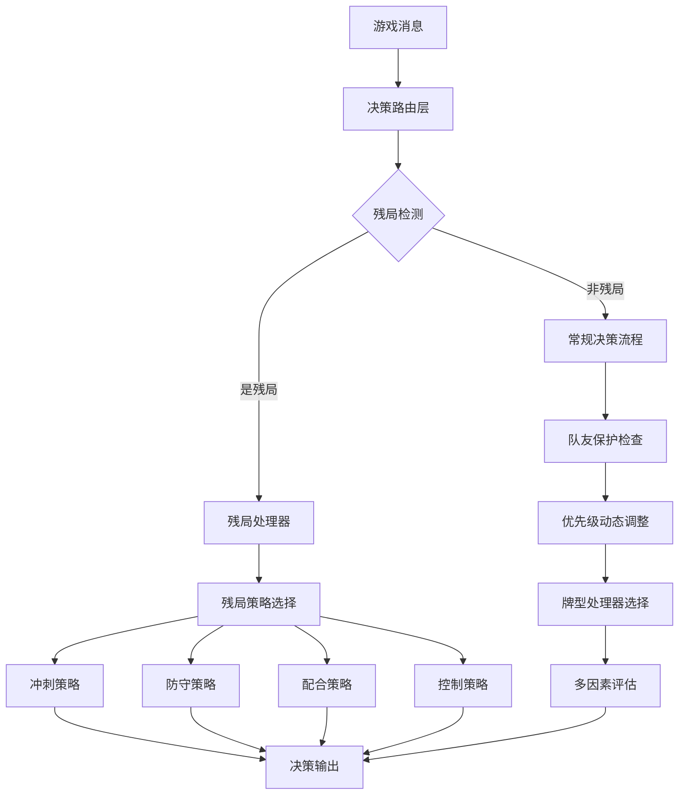

# YF掼蛋硬编码优化系统设计文档

## 概述

本文档描述了YF掼蛋AI硬编码优化系统的技术设计，该系统旨在通过智能残局处理、增强队友保护和动态优先级调整来提升掼蛋AI的胜率从40-45%提升到45-55%。系统采用分层模块化架构，保持lalala的"简单直接"设计哲学，同时增加可扩展性和可维护性。

## 架构设计

### 整体架构

```
YF掼蛋优化系统
├── 决策路由层 (Decision Router)
│   ├── 阶段识别器 (Stage Identifier)
│   ├── 残局检测器 (Endgame Detector)
│   └── 决策分发器 (Decision Dispatcher)
│
├── 策略执行层 (Strategy Execution)
│   ├── 残局处理器 (Endgame Handler)
│   ├── 队友保护器 (Teammate Protector)
│   ├── 优先级调整器 (Priority Adjuster)
│   └── 牌型处理器工厂 (Card Type Handler Factory)
│
├── 分析评估层 (Analysis & Evaluation)
│   ├── 手牌结构分析器 (Hand Structure Analyzer)
│   ├── 多因素评估器 (Multi-Factor Evaluator)
│   ├── 上下文分析器 (Context Analyzer)
│   └── 性能监控器 (Performance Monitor)
│
└── 配置管理层 (Configuration Management)
    ├── 策略配置加载器 (Strategy Config Loader)
    ├── 热更新管理器 (Hot Reload Manager)
    └── A/B测试管理器 (A/B Test Manager)
```

### 核心组件交互



## 组件设计

### 1. 残局处理系统 (Endgame Handler)

#### 设计目标
- 多维度残局判断（自己+队友+对手牌数）
- 4种残局类型的智能识别和处理
- 比lalala更精确的残局策略

#### 核心接口
```python
class EndgameHandler:
    def detect_endgame(self, message: Dict) -> Tuple[bool, str]
    def execute_strategy(self, endgame_type: str, message: Dict) -> int
    def get_strategy_explanation(self) -> Dict
```

#### 残局类型分类
1. **冲刺型** (Rush): 自己牌少，需快速出完
2. **防守型** (Defend): 队友牌少，需保护队友
3. **配合型** (Cooperate): 队友牌少，需配合出牌
4. **控制型** (Control): 自己牌多，需控制节奏

### 2. 队友保护系统 (Teammate Protection)

#### 设计目标
- 多规则组合的保护策略
- 动态保护强度调整
- 可配置的保护参数

#### 核心接口
```python
class TeammateProtectionStrategy:
    def should_protect(self, message: Dict) -> Tuple[bool, Dict]
    def get_protection_action(self, message: Dict) -> Optional[int]
    def evaluate_protection_rules(self, message: Dict) -> Dict
```

#### 保护规则
1. **高牌值保护**: 队友出A、2、王时的保护
2. **低牌数保护**: 队友剩余牌数少时的保护
3. **关键阶段保护**: 关键时刻的动态保护
4. **炸弹保护**: 队友出炸弹时的绝对保护

### 3. 动态优先级系统 (Dynamic Priority)

#### 设计目标
- 根据上下文动态调整决策优先级
- 多因素综合评估
- 可配置的优先级规则

#### 核心接口
```python
class DynamicPrioritySystem:
    def adjust_priorities(self, base_scores: List[float], context: Dict) -> List[float]
    def get_context_adjusters(self) -> List[ContextAdjuster]
    def explain_adjustments(self) -> Dict
```

#### 上下文调整器
1. **下家牌数调整器**: 根据下家牌数调整单张优先级
2. **PASS次数调整器**: 根据连续PASS次数调整出牌优先级
3. **残局调整器**: 根据残局类型调整各牌型优先级
4. **队友状态调整器**: 根据队友状态调整PASS优先级

### 4. 手牌结构分析器 (Hand Structure Analyzer)

#### 设计目标
- 比lalala更深入的手牌结构分析
- 组合潜力和灵活性评估
- 高性能分析（<50ms）

#### 核心接口
```python
class HandStructureAnalyzer:
    def analyze(self, handcards: List, rank: str) -> Dict
    def calculate_flexibility_score(self, structure: Dict) -> float
    def identify_combo_potential(self, structure: Dict) -> Dict
```

#### 分析维度
1. **基础牌型识别**: 单张、对子、三张、顺子、炸弹
2. **牌值分布分析**: 各牌值的分布情况
3. **组合潜力评估**: 可能形成的组合
4. **灵活性评分**: 手牌的灵活性和威胁等级

## 数据模型

### 游戏状态模型
```python
@dataclass
class GameState:
    my_pos: int
    my_cards: List[str]
    teammate_pos: int
    teammate_cards: int
    opponents_cards: List[int]
    current_action: Optional[List]
    greater_action: Optional[List]
    stage: str
    rank: str
```

### 决策上下文模型
```python
@dataclass
class DecisionContext:
    is_endgame: bool
    endgame_type: str
    teammate_is_greater: bool
    next_player_remain: int
    pass_count: int
    protection_score: float
    priority_adjustments: Dict[str, float]
```

### 手牌结构模型
```python
@dataclass
class HandStructure:
    single_member: List[str]
    pair_member: List[str]
    trip_member: List[str]
    bomb_member: List[str]
    straight_member: List[str]
    card_value_distribution: Dict[str, int]
    combo_potential: Dict[str, List]
    flexibility_score: float
    threat_level: float
```

## 正确性属性

*一个属性是一个特征或行为，应该在系统的所有有效执行中保持真实——本质上，是关于系统应该做什么的正式声明。属性作为人类可读规范和机器可验证正确性保证之间的桥梁。*

### 残局处理属性

**属性 1: 多维度残局检测**
*对于任何* 掼蛋游戏状态，当系统检测残局时，应该综合考虑自己、队友和对手的牌数，而不仅仅基于自身牌数
**验证: 需求 1.1**

**属性 2: 冲刺型残局策略**
*对于任何* 被识别为冲刺型的残局状态，系统应该优先选择能快速出完牌的动作（如一手出完、大牌型）
**验证: 需求 1.2**

**属性 3: 防守型残局策略**
*对于任何* 被识别为防守型的残局状态，系统应该优先选择保护队友的动作（如PASS或小牌）
**验证: 需求 1.3**

**属性 4: 配合型残局策略**
*对于任何* 被识别为配合型的残局状态，系统应该选择有利于队友出牌的动作
**验证: 需求 1.4**

**属性 5: 控制型残局策略**
*对于任何* 被识别为控制型的残局状态，系统应该选择控制出牌节奏的动作
**验证: 需求 1.5**

### 队友保护属性

**属性 6: 高价值牌保护**
*对于任何* 队友出高价值牌（A、2、王）的情况，系统应该正确评估保护需求并选择PASS或最小管牌
**验证: 需求 2.1**

**属性 7: 低牌数保护**
*对于任何* 队友剩余牌数少于等于5张的情况，系统应该提高保护优先级
**验证: 需求 2.2**

**属性 8: 动态保护强度**
*对于任何* 处于关键阶段且对手牌数也很少的情况，系统应该动态调整保护强度
**验证: 需求 2.3**

**属性 9: 炸弹绝对保护**
*对于任何* 队友打出炸弹的情况，系统应该绝对不压制队友
**验证: 需求 2.4**

**属性 10: 多规则综合评估**
*对于任何* 多个保护规则同时触发的情况，系统应该综合评估并选择最佳保护策略
**验证: 需求 2.5**

### 动态优先级属性

**属性 11: 下家单张优先级调整**
*对于任何* 下家剩余牌数为1张的情况，系统应该降低单张出牌优先级
**验证: 需求 3.1**

**属性 12: PASS次数优先级调整**
*对于任何* 连续PASS次数超过5次的情况，系统应该提高出牌动作优先级
**验证: 需求 3.2**

**属性 13: 残局优先级调整**
*对于任何* 处于残局阶段的情况，系统应该根据残局类型调整各牌型优先级
**验证: 需求 3.3**

**属性 14: 队友领先优先级调整**
*对于任何* 队友处于领先状态且牌数少的情况，系统应该大幅提高PASS优先级
**验证: 需求 3.4**

**属性 15: 实时优先级调整**
*对于任何* 游戏上下文发生变化的情况，系统应该实时调整优先级权重
**验证: 需求 3.5**

### 手牌分析属性

**属性 16: 完整牌型识别**
*对于任何* 掼蛋手牌，系统应该正确识别所有基础牌型成员（单张、对子、三张、顺子、炸弹等）
**验证: 需求 5.1**

**属性 17: 牌值分布计算**
*对于任何* 掼蛋手牌，系统应该正确计算牌值分布和组合潜力
**验证: 需求 5.2**

**属性 18: 组合识别**
*对于任何* 掼蛋手牌，系统应该正确识别可破坏和受保护的组合
**验证: 需求 5.3**

**属性 19: 评分计算**
*对于任何* 掼蛋手牌，系统应该正确计算手牌灵活性和威胁等级评分
**验证: 需求 5.4**

**属性 20: 分析性能**
*对于任何* 掼蛋手牌结构分析，系统应该在50毫秒内返回分析结果
**验证: 需求 5.5**

### 性能属性

**属性 21: 平均决策时间**
*对于任何* 决策请求，系统应该在平均200毫秒内完成决策
**验证: 需求 6.1**

**属性 22: 最大决策时间**
*对于任何* 决策请求，系统应该在最大500毫秒内完成决策
**验证: 需求 6.2**

**属性 23: 内存使用限制**
*对于任何* 系统运行状态，内存使用量应该保持在100MB以下
**验证: 需求 6.3**

**属性 24: 系统稳定性**
*对于任何* 连续100局游戏运行，系统应该不出现崩溃或异常
**验证: 需求 6.4**

**属性 25: 决策时间稳定性**
*对于任何* 复杂决策场景，系统应该保持决策时间稳定性
**验证: 需求 6.5**

### 胜率属性

**属性 26: V4版本胜率**
*对于任何* 与V4版本的对战，系统胜率应该超过52%
**验证: 需求 8.2**

**属性 27: V5版本胜率**
*对于任何* 与V5版本的对战，系统胜率应该超过50%
**验证: 需求 8.3**

**属性 28: lalala胜率**
*对于任何* 与lalala的对战，系统胜率应该超过45%
**验证: 需求 8.4**

### 兼容性属性

**属性 29: 接口兼容性**
*对于任何* 现有接口调用，系统应该返回兼容的结果格式
**验证: 需求 10.2**

**属性 30: 配置兼容性**
*对于任何* 现有配置使用，系统应该正确解析并应用配置参数
**验证: 需求 10.3**

## 错误处理

### 错误分类
1. **配置错误**: 配置文件格式错误、参数超出范围
2. **运行时错误**: 决策超时、内存不足、网络异常
3. **逻辑错误**: 残局检测失败、保护策略冲突
4. **性能错误**: 决策时间超限、内存使用超限

### 错误处理策略
1. **优雅降级**: 使用默认配置和简化策略
2. **快速恢复**: 自动回滚到上一个稳定状态
3. **详细日志**: 记录完整的错误信息和上下文
4. **监控告警**: 实时监控系统状态和性能指标

## 测试策略

### 双重测试方法

本系统采用单元测试和基于属性的测试相结合的方法：

**单元测试**:
- 验证具体示例、边界情况和错误条件
- 测试组件间的集成点
- 覆盖特定的业务逻辑场景

**基于属性的测试**:
- 验证应该在所有输入中保持的通用属性
- 使用QuickCheck for Python作为属性测试库
- 每个属性测试运行最少100次迭代
- 每个基于属性的测试都标记有对应的设计文档属性引用

**属性测试要求**:
- 使用格式标记每个属性测试: **功能: yf-hardcoded-optimization, 属性 {编号}: {属性文本}**
- 每个正确性属性必须由单个属性测试实现
- 属性测试应该尽可能避免使用模拟，以测试真实功能

**测试覆盖范围**:
- 残局处理: 属性1-5的属性测试 + 边界情况单元测试
- 队友保护: 属性6-10的属性测试 + 规则冲突单元测试  
- 动态优先级: 属性11-15的属性测试 + 上下文变化单元测试
- 手牌分析: 属性16-20的属性测试 + 性能基准测试
- 系统性能: 属性21-25的属性测试 + 负载测试
- 胜率验证: 属性26-28的属性测试 + 长期对战测试
- 兼容性: 属性29-30的属性测试 + 回归测试

### 测试环境
- **开发环境**: 快速单元测试和属性测试
- **集成环境**: 完整的系统集成测试
- **性能环境**: 性能基准测试和压力测试
- **对战环境**: 胜率验证和长期稳定性测试

## 部署和监控

### 部署策略
1. **蓝绿部署**: 零停机时间的版本切换
2. **灰度发布**: 逐步推广新版本
3. **回滚机制**: 快速回滚到稳定版本

### 监控指标
1. **性能指标**: 决策时间、内存使用、CPU使用率
2. **业务指标**: 胜率、决策准确率、系统稳定性
3. **错误指标**: 异常率、超时率、崩溃率

### 告警机制
1. **实时告警**: 系统异常、性能超限
2. **趋势告警**: 胜率下降、性能退化
3. **容量告警**: 资源使用接近上限