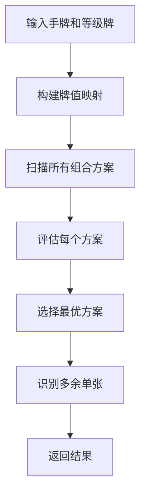

# 手牌最优组合扫描器设计说明

## 📋 概述

`OptimalCombinationScanner`（手牌最优组合扫描器）是M1智能体的核心组件之一，用于在出牌前分析手牌结构，识别最优组合方案和多余单张，帮助智能体做出更合理的出牌决策。

### 级牌和红桃配识别

扫描器能够正确识别级牌和红桃配：

- **级牌识别**：根据游戏消息中的 `curRank` 参数识别当前级牌
  - 例如：如果 `curRank = "9"`，则级牌是9
  - 所有花色的9（S9, H9, C9, D9）都是级牌

- **红桃配识别**：红桃配是红心级牌，格式为 `H + rank`
  - 例如：如果级牌是"9"，红桃配是"H9"
  - 例如：如果级牌是"2"，红桃配是"H2"
  - 红桃配是万能牌，可以作为任意牌点使用

- **级牌统计**：在统计卡牌数量时，红桃配会被排除（因为它是万能牌）
  - 例如：如果有 S9, C9, D9, H9，统计时会排除H9，只统计3张9
  - 如果有3张非红桃的9，可以用红桃9（H9）配成4头炸

### 牌值大小关系

扫描器正确实现了掼蛋的牌值大小关系：

**牌值映射**：
- 3-9, T, J, Q, K, A: 3-14
- **级牌**: 15（可压制A及以下）
- **小王(B)**: 16（可压制级牌及以下）
- **大王(R)**: 17（可压制小王及以下）

**压制关系验证**：
- ✓ 级牌(15) > A(14)
- ✓ 小王(16) > 级牌(15)
- ✓ 大王(17) > 小王(16)

**动态级牌识别**：
- 扫描器会根据 `curRank` 参数动态识别级牌
- 例如：当 `curRank = "9"` 时，所有9都是级牌，值为15
- 例如：当 `curRank = "2"` 时，所有2都是级牌，值为15

## 🎯 核心功能

1. **扫描所有可能的组合方案** - 生成多种手牌组合策略
2. **评估组合优劣** - 通过评分系统选择最优方案
3. **识别多余单张** - 找出不在任何组合中的单张，优先出掉
4. **提供备选方案** - 保留评分前3的组合方案供参考

## 🏗️ 架构设计

### 核心组件

```
OptimalCombinationScanner
├── HandCombiner (依赖)
│   └── combine_handcards() - 基础手牌组合
└── 核心方法
    ├── scan_optimal_combination() - 主入口
    ├── _scan_all_combinations() - 扫描所有方案
    ├── _evaluate_combination() - 评估组合
    └── _identify_excess_singles() - 识别多余单张
```

### 工作流程



## 🔍 核心原则

### 1. **多策略扫描原则**

扫描器会尝试多种组合策略，确保找到最优方案：

```python
# 方案1：优先使用红桃配（级牌红桃配策略）
red_heart_combo = self._try_red_heart_wildcard_first(handcards, rank, card_val)

# 方案2：优先同花顺（如果可能）
combo1 = self._try_straight_flush_first(handcards, rank, card_val)

# 方案3：优先炸弹（保留所有炸弹）
combo2 = self._try_bomb_first(handcards, rank, card_val)

# 方案4：平衡方案（同花顺+顺子+炸弹）
combo3 = self._try_balanced(handcards, rank, card_val)
```

**设计理念**：
- 不同手牌结构适合不同策略
- 通过多策略对比，找到最适合当前手牌的组合方案
- 避免单一策略导致的次优解
- **红桃配策略优先**：红桃配是万能牌，使用得当可以大幅提升手牌质量

### 2. **评分系统原则**

采用多维度评分体系，综合评估组合质量：

```python
评分标准：
1. 手数越少越好（减少轮次）     → 每减少一手 +50分
2. 单张越少越好                 → 每个单张 -10分
3. 炸弹越多越好                 → 每个炸弹 +100分
4. 同花顺优先                   → 每个同花顺 +80分
5. 顺子优先                     → 每个顺子 +40分
6. 三带二、三连对、钢板优先      → 每个 +30分
```

**设计理念**：
- **手数优先**：减少出牌轮次，提高出牌效率
- **组合优先**：保留高价值组合（炸弹、同花顺、顺子）
- **单张惩罚**：单张过多会降低手牌质量，需要优先处理

### 3. **多余单张识别原则**

**多余单张的定义**：
- 不在同花顺中
- 不在顺子中
- 不在炸弹中
- 不在三带二中
- 不在三连对中
- 不在钢板中
- 不在对子中（如果是对子的一部分，不算多余）
- 不在三张中（如果是三张的一部分，不算多余）

**识别逻辑**：
```python
# 1. 收集所有在组合中的卡牌
used_cards = set()
# 遍历所有组合类型，收集已使用的卡牌

# 2. 找出不在任何组合中的单张
excess_singles = []
for card in handcards:
    if card not in used_cards:
        excess_singles.append(card)
```

**设计理念**：
- **保护组合**：确保重要组合不被破坏
- **优先处理**：多余单张应该优先出掉，避免影响后续组合
- **精确识别**：准确区分"多余单张"和"组合中的单张"

### 4. **组合优先级原则**

扫描器按照以下优先级尝试组合：

```
优先级1: 红桃配策略（RedHeartWildcard）
优先级2: 同花顺（StraightFlush）
优先级3: 炸弹（Bomb）
优先级4: 顺子（Straight）
优先级5: 三带二、三连对、钢板（ThreeWithTwo, ThreePair, TwoTrips）
优先级6: 对子、三张（Pair, Trips）
优先级7: 单张（Single）
```

**设计理念**：
- **红桃配优先**：红桃配是万能牌，优先考虑使用红桃配优化组合
- **高价值优先**：优先保留高价值组合
- **不拆组合**：避免为了低价值组合而拆散高价值组合
- **灵活调整**：根据手牌实际情况动态调整优先级

### 5. **红桃配使用原则**

红桃配（红心级牌）是掼蛋游戏中的万能牌，使用得当可以大幅提升手牌质量。

**红桃配使用优先级（根据实战统计）**：

1. **配炸弹（85%使用率）**
   - 配4头炸（51%）：最优先，特别是和小3头成炸弹，称为"麻雀变凤凰"
   - 配6头炸（5%）：质量较高，闯关时十拿九稳
   - 忌配5头炸（1%）：数量没增加，质量也不够，一般不配

2. **配同花顺（28%使用率）**
   - 同花顺威力大，但不要拆炸配同花
   - 除非送队友或管压对手最后一手牌

3. **补缺（12%使用率）**
   - 配顺子：单张过多时，用红桃配补缺成顺，手数大大降低
   - 配木板（三连对）：减少手数，便于争上游
   - 配钢板：主要是主攻减少手数

4. **残局运用**
   - 配小对子：防对手或送队友
   - 配顺子：送队友或管压对手
   - 配三带二：减少手数，便于争上游

**设计理念**：
- **配炸优先**：实战中逢人配成炸的比例为85%，配4头炸最经济实用
- **不拆炸配同花**：除非特殊情况，不要破俩炸弹组同花顺
- **预留三张配百搭**：红心配炸弹留到最后再使用，以便随机应变
- **残局救场**：在牌局即将失控时，红心级牌是救场牌

## 🔧 技术实现

### 1. 组合扫描策略

#### 策略1：同花顺优先
```python
def _try_straight_flush_first(self, handcards, rank, card_val):
    """尝试优先组成同花顺的方案"""
    sorted_cards, bomb_info = self.combiner.combine_handcards(handcards, rank, card_val)
    straight_flush = sorted_cards.get("StraightFlush", [])
    if straight_flush:
        return {
            'strategy': 'straight_flush_first',
            'sorted_cards': sorted_cards,
            'bomb_info': bomb_info
        }
    return {}
```

#### 策略2：炸弹优先
```python
def _try_bomb_first(self, handcards, rank, card_val):
    """尝试优先保留炸弹的方案"""
    sorted_cards, bomb_info = self.combiner.combine_handcards(handcards, rank, card_val)
    bombs = sorted_cards.get("Bomb", [])
    if bombs:
        return {
            'strategy': 'bomb_first',
            'sorted_cards': sorted_cards,
            'bomb_info': bomb_info
        }
    return {}
```

#### 策略1：红桃配优先
```python
def _try_red_heart_wildcard_first(self, handcards, rank, card_val):
    """尝试优先使用红桃配的策略"""
    # 检查是否有红桃配
    if not self._has_red_heart_wildcard(handcards, rank):
        return {}
    
    # 使用基础组合作为起点
    sorted_cards, bomb_info = self.combiner.combine_handcards(handcards, rank, card_val)
    
    # 尝试用红桃配优化组合
    optimized_sorted_cards = self._optimize_with_red_heart(handcards, sorted_cards, rank, card_val, red_heart_card)
    
    return {
        'strategy': 'red_heart_wildcard_first',
        'sorted_cards': optimized_sorted_cards,
        'bomb_info': bomb_info,
        'red_heart_used': True
    }
```

**红桃配优化策略**：
```python
def _optimize_with_red_heart(self, handcards, sorted_cards, rank, card_val, red_heart_card):
    """使用红桃配优化组合"""
    # 策略1：配4头炸（最优先，51%使用率）
    # 如果有3张相同点数的牌，可以用红桃配组成4头炸
    
    # 策略2：配6头炸（5%使用率）
    # 如果有5张相同点数的牌，可以用红桃配组成6头炸
    
    # 策略3：配同花顺（28%使用率）
    # 如果有4张同花顺的牌，缺1张，可以用红桃配补缺
    
    # 策略4：配顺子补缺（12%使用率）
    # 如果有单张可以组成顺子，用红桃配补缺
```

#### 策略4：平衡方案
```python
def _try_balanced(self, handcards, rank, card_val):
    """尝试平衡方案（同花顺+顺子+炸弹）"""
    sorted_cards, bomb_info = self.combiner.combine_handcards(handcards, rank, card_val)
    return {
        'strategy': 'balanced',
        'sorted_cards': sorted_cards,
        'bomb_info': bomb_info
    }
```

### 2. 评分算法

```python
def _evaluate_combination(self, combo, handcards, rank, card_val):
    score = 0.0
    
    # 1. 计算手数（每种牌型算一手）
    hand_count = 0
    for card_type in ['Single', 'Pair', 'Trips', ...]:
        cards = sorted_cards.get(card_type, [])
        if cards:
            hand_count += len(cards)
    
    # 手数越少，评分越高
    score += (27 - hand_count) * 50
    
    # 2. 单张越少越好
    singles = sorted_cards.get("Single", [])
    score -= len(singles) * 10
    
    # 3. 炸弹越多越好
    bombs = sorted_cards.get("Bomb", [])
    score += len(bombs) * 100
    
    # 4. 同花顺优先
    straight_flush = sorted_cards.get("StraightFlush", [])
    score += len(straight_flush) * 80
    
    # 5. 顺子优先
    straights = sorted_cards.get("Straight", [])
    score += len(straights) * 40
    
        # 6. 三带二、三连对、钢板优先
        three_with_two = sorted_cards.get("ThreeWithTwo", [])
        three_pair = sorted_cards.get("ThreePair", [])
        two_trips = sorted_cards.get("TwoTrips", [])
        score += (len(three_with_two) + len(three_pair) + len(two_trips)) * 30
    
        # 7. 红桃配使用奖励（如果使用了红桃配策略）
        if combo.get('red_heart_used', False):
            # 红桃配配成炸弹额外奖励
            bombs = sorted_cards.get("Bomb", [])
            red_heart_bombs = [bomb for bomb in bombs if any(card.startswith('H') and card[1:] == rank for card in bomb)]
            if red_heart_bombs:
                # 配成4头炸奖励最高（+150分）
                for bomb in red_heart_bombs:
                    if len(bomb) == 4:
                        score += 150
                    elif len(bomb) == 6:
                        score += 120  # 配成6头炸奖励次之
                    else:
                        score += 100  # 其他炸弹奖励
            
            # 红桃配配成同花顺额外奖励（+100分）
            straight_flush = sorted_cards.get("StraightFlush", [])
            red_heart_sf = [sf for sf in straight_flush if any(card.startswith('H') and card[1:] == rank for card in (sf if isinstance(sf, list) else [sf]))]
            if red_heart_sf:
                score += len(red_heart_sf) * 100
    
    return score
```

### 3. 多余单张识别

```python
def _identify_excess_singles(self, handcards, optimal_combo, rank, card_val):
    """识别多余单张（不在任何组合中的单张）"""
    
    # 1. 获取最优组合
    sorted_cards = optimal_combo['sorted_cards']
    
    # 2. 收集所有在组合中的卡牌
    used_cards = set()
    
    # 遍历所有组合类型
    for sf in sorted_cards.get("StraightFlush", []):
        used_cards.update(sf if isinstance(sf, list) else [sf])
    
    for st in sorted_cards.get("Straight", []):
        used_cards.update(st if isinstance(st, list) else [st])
    
    # ... 其他组合类型
    
    # 3. 找出不在任何组合中的单张
    excess_singles = []
    for card in handcards:
        if card not in used_cards:
            excess_singles.append(card)
    
    return excess_singles
```

## 📊 使用场景

### 1. 主动出牌场景

```python
# 在出牌前扫描手牌最优组合
scan_result = self._scan_hand_combination(message)
excess_singles = scan_result.get('excess_singles', [])

# 如果有多余单张，优先出单张
if excess_singles:
    for i, action in enumerate(action_list):
        if action[0] == 'Single' and action[1] in excess_singles:
            return i  # 选择多余单张出牌
```

**效果**：
- 优先出掉多余单张，避免破坏重要组合
- 减少手数，提高出牌效率
- 保留高价值组合（炸弹、同花顺等）

### 2. 被动出牌场景

```python
# 找出可以顺走的多余单张
suitable_singles = self._find_excess_singles_for_action(message, cur_action_rank)

# 优先用多余单张压制对手
if suitable_singles:
    for i, action in enumerate(action_list):
        if action[0] == 'Single' and action[1] in suitable_singles:
            return i  # 用多余单张压制
```

**效果**：
- 在被动出牌时，优先用多余单张压制对手
- 既压制了对手，又顺走了多余单张
- 一举两得，提高出牌效率

## 🎨 设计优势

### 1. **多策略对比**
- 不是单一策略，而是尝试多种组合方案
- 通过评分系统选择最优方案
- 避免局部最优，追求全局最优

### 2. **精确识别**
- 准确区分"多余单张"和"组合中的单张"
- 保护重要组合不被破坏
- 提高出牌决策的准确性

### 3. **灵活适配**
- 根据手牌实际情况动态调整策略
- 支持不同游戏阶段的特殊需求
- 可扩展性强，易于优化

### 4. **性能优化**
- 使用缓存机制（如果实现）
- 避免重复计算
- 快速响应，不影响游戏流畅性

## 🔄 与其他组件的协作

### 1. 与优先级系统协作
```python
# 扫描器提供多余单张信息
scan_result = self._scan_hand_combination(message)
excess_singles = scan_result.get('excess_singles', [])

# 优先级系统使用扫描结果优化决策
if self.priority_system:
    # 将多余单张信息传递给优先级系统
    context['excess_singles'] = excess_singles
    selected_idx = self.priority_system.select(candidates, hand_structure, context)
```

### 2. 与阶段处理器协作
```python
# 各阶段处理器在出牌前调用扫描器
class MidEarlyActiveHandler(BasePhaseHandler):
    def handle(self, message):
        # 扫描手牌最优组合
        scan_result = self._scan_hand_combination(message)
        excess_singles = scan_result.get('excess_singles', [])
        
        # 根据扫描结果优化出牌决策
        if excess_singles:
            # 优先出多余单张
            ...
```

## 📈 优化建议

### 1. **评分权重优化**
- 根据游戏阶段动态调整评分权重
- 残局阶段更重视手数，开局阶段更重视组合质量
- 可以通过机器学习优化权重参数

### 2. **组合策略扩展**
- 增加更多组合策略（如"顺子优先"、"对子优先"等）
- 根据手牌特征自动选择最适合的策略
- 支持策略组合（如"同花顺+炸弹"组合策略）

### 3. **性能优化**
- 实现组合结果缓存
- 优化组合扫描算法，减少计算量
- 使用并行计算加速多策略对比

### 4. **智能学习**
- 记录每次扫描结果和实际游戏结果
- 通过强化学习优化评分系统
- 根据历史数据调整策略优先级

## 📝 总结

手牌最优组合扫描器是M1智能体的核心组件，通过多策略扫描、评分系统和精确识别，帮助智能体做出更合理的出牌决策。其设计遵循以下核心原则：

1. **多策略对比** - 尝试多种组合方案，选择最优
2. **评分系统** - 多维度评估，综合判断
3. **精确识别** - 准确区分多余单张和组合中的单张
4. **灵活适配** - 根据实际情况动态调整策略

通过这些原则，扫描器能够有效提高智能体的出牌质量，减少不必要的组合破坏，提高游戏胜率。

