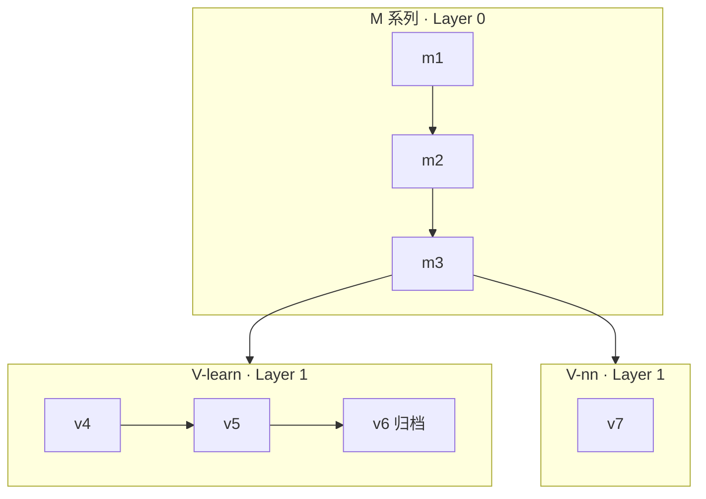

# 掼蛋智能体 M/V 系列仓库治理方案

| 项目 | 内容 |
|------|------|
| 文档版本 | v1.4 |
| 状态 | 已采纳（团队执行基准） |
| 适用范围 | YiFeiAI-GD 仓库全体协作与分支/产物管理 |
| 最后更新 | 2026-05-29（§5.5–§5.8 仓库全景整理方案；`main` 策略见 [main-branch-policy.md](./main-branch-policy.md)） |

---

## 1. 背景与目标

### 1.1 现状

- 仓库同时存在 **M 系列**（平台/工程底座，m1→m2→m3…）与 **V 系列**（智能体/学习范式，v4–v7）两条路径。
- **当前主迭代为 M 系列**，对战对象为 **lalala**，**尚无稳定胜率**，因此 **尚未将 M 能力同步应用到 V 系列**。
- 历史上存在双远程（Gitee `origin`、GitHub `github`）、多分支分叉、根目录脚本与模型/日志进库等问题。

### 1.2 目标

1. **概念清晰**：M = 底座，V = 可插拔智能体；V 内再分「自学」与「神经网络」两条子路径。
2. **协作可执行**：分支、PR、冒烟、产物存放有明文规则。
3. **可复现、可根因**：大文件不进 Git，回归数据与 manifest 可跨机器拉取。
4. **阶段匹配**：在 V 未挂接前，不以 v5 作为改 M 的默认门禁。

---

## 2. 系列定义与依赖关系

### 2.1 M 系列（Platform / 底座）

| 代号 | 定位 | 典型内容 |
|------|------|----------|
| m1 | 最小可参赛：平台连通、双客户端、基础策略 | `yf1_m1.py`、`yf2_m1.py`、通信、回放、lalala 适配 |
| m2 | 工程化：批跑、离线平台、脚本与文档 | `batch_executor/`、`offline_platform/`、`scripts/` |
| m3 | 可复用契约：V 仅依赖稳定接口 | `IDecisionProvider`（或等价契约，待 m3 冻结文档） |
| m4+ | 后续底座代际 | 按 m 代数扩展，不占用 v 版本号 |

**原则**：M 被 V 依赖；V 不得破坏 M 的通信/状态/记录契约。

### 2.2 V 系列（Intelligence / 智能体）

V 系列不是 M 的简单版本号延续，而是 **挂在 M 上的决策与学习实现**。

#### 2.2.1 V-learn（自主学习路径）

| 代号 | 倾向 | 说明 |
|------|------|------|
| v4 | 规则 + 适配 | 偏对接与验证 |
| v5 | 混合决策引擎 + 阶段训练 | 当前自学主线参考实现 |
| v6 | MOE 等实验 | 建议归档分支 `v6-dev`，不纳入 m 日常合并 |

#### 2.2.2 V-nn（神经网络路径）

| 代号 | 倾向 | 说明 |
|------|------|------|
| v7 | 胜率引擎 + 模型推理 | 分支 `v7-dev`，与 v6 **不同阶梯** |



### 2.3 三层物理分类（与 Git 无关）

| 层级 | 名称 | 内容 | 进 Git |
|------|------|------|--------|
| Layer 0 | M-Platform | 通信、状态、客户端壳、批跑、规则骨架 | 是（代码） |
| Layer 1 | V-Intelligence | 决策引擎、训练脚本、适配器 | 是（代码） |
| Layer 2 | Artifacts | 模型权重、全量 replay、训练日志 | **否**（见第 6 节） |

---

## 3. 当前阶段策略（2026-Q2）

| 项 | 约定 |
|----|------|
| 默认开发分支 | **`m-dev`**（Gitee `origin`） |
| 对战与验收对象 | **lalala** |
| V 系列 | **独立迭代，不阻塞 M**；未达挂接条件前不默认跑 V 全量冒烟 |
| 本地历史 `main` | 视为 **训练/实验归档线**，非日常开发目标 |
| V 默认冒烟 | **OFF**（触发条件见第 7.2 节） |

---

## 4. 分支与远程治理

### 4.1 远程仓库

| 远程名 | 地址角色 | 策略 |
|--------|----------|------|
| **`origin`** | Gitee，**唯一真相源** | 所有功能分支 push 目标 |
| **`github`** | 镜像（**按需同步**） | 真相源仍为 `origin`；`develop` 已废弃；用 [sync_github_mirror.ps1](../../scripts/tools/sync_github_mirror.ps1) 推送 `m-dev` |

### 4.2 分支对照表

| 分支 | 系列 | 角色 | 日常开发 |
|------|------|------|----------|
| **`m-dev`** | M | 主集成线（m1→m2→m3） | **是** |
| **`v7-dev`** | V-nn | v7 实验 | 仅 V7 相关时 |
| **`v6-dev`** | V-learn | MOE 等归档 | 否（只读参考） |
| **`main`** | 混合/发布 | 稳定快照；**当前冻结**于 `e767f28`（tag `archive/main-pre-governance-20260528`） | 否（仅里程碑合并，见 [main-branch-policy.md](./main-branch-policy.md)） |
| 治理前 `main` 快照 | 历史 | 与上表同一 commit；V 阶段训练历史 | 否（只读；勿在 `main` 上日常提交） |
| ~~`develop`~~ | — | Gitee 已删除 | 不恢复 |

版本与状态明细见：[docs/versions/MATRIX.md](../versions/MATRIX.md)。

### 4.3 合并方向

```
v7-dev ──(评审+测试)──► m-dev ──(里程碑)──► main
v6-dev     ✗ 默认不合并入 m-dev
```

---

## 5. 目录与命名（目标形态）

### 5.1 对外（短期可保留现有文件名）

- 客户端：`yf1_m1.py`、`yf2_m1.py`、`yf1_v5.py`、`yf1_v7.py` 等。
- PR / Issue 标签：`[M-m2]`、`[V-learn-v5]`、`[V-nn-v7]`、`[artifact]`。

### 5.2 对内（m3 起逐步迁移）

```
src/
  m/                 # M 系列共享与代际代码（目标）
  v/
    learn/           # v4, v5, v6
    nn/              # v7+
  contracts/         # IDecisionProvider 等（m3 冻结）
```

### 5.3 根目录收敛原则

| 现状问题 | 目标 |
|----------|------|
| 根目录大量 `.py` | 迁入 `scripts/` 或 `tools/` |
| `models/*.pth` 进库 | 仅保留说明 + 当前 1～2 个指针；权重走对象存储 |
| `logs/`、`training_logs/` | `.gitignore`，本地或 OSS |
| `game_records/`、`trajectories/` | 归并为 `data/replays/`、`data/trajectories/`（迁移期可并存） |
| 根目录 `doc/` 与散落 M 代际文档 | 并入 `docs/guandan-brain/`（M1/M2/M3 架构与诊断台账） |

### 5.4 文档目录（与代码收敛同步）

| 目录 | 用途 |
|------|------|
| `docs/governance/` | 治理总纲、COS、handoff、**文档审查台账** |
| `docs/guandan-brain/` | M 系列迭代真源：ISSUES / ITERATIONS / **M1/M2/M3 代际文档** |
| `../guandan-brain/handoff/` | 具体任务 handoff（换机 / 新 Agent 接续） |
| `docs/versions/MATRIX.md` | 分支与冒烟状态矩阵 |

M 代际文档索引见 [docs/guandan-brain/README.md](../guandan-brain/README.md)（含 `M2_OPTIMIZATION.md`、`M3_DIAGNOSIS.md`）。

### 5.5 结论：启动脚本与其它入口 **应当归类**

Phase 4 已把根目录 **`.py` 工具脚本** 迁入 `scripts/`，但 **`.bat` / `.sh` 启动器** 与 **根目录状态型 `.md`** 仍大量留在仓库根，造成「目录乱」的主观感受。

**原则（与文档 stub 相同）**：

| 原则 | 说明 |
|------|------|
| **真源唯一** | 可执行逻辑只在 `scripts/`、`src/`、`batch_executor/`；根目录不放第二份实现 |
| **根目录 = 快捷方式层** | 允许保留 **薄包装**（`.bat` 仅 `cd` 到仓库根 + 调用真源），便于双击与旧教程 |
| **按 M/V 分桶** | 启动器目录与 §2 系列、§5.2 `src/m|v` 命名一致，一眼可知归属 |
| **不破坏肌肉记忆** | 迁移时旧路径保留 stub 至少一个发布周期；README 附对照表 |

**不建议**：把几十个 `.bat` 永远堆在根目录且无任何索引（当前状态）。

### 5.6 仓库根目录扫描（2026-05-29）

#### 5.6.1 启动类 `.bat`（26 个，均应纳入 Phase 5）

| 分组 | 文件 | 当前调用目标 | 建议真源目录 |
|------|------|--------------|--------------|
| **M · GUI** | `START_M1_GUI.bat` | `scripts/gui/batch_executor_gui_m1.py` | `scripts/launchers/m/`；根目录 `batch_executor_gui_m1.py` 为 stub |
| | `START_M2_GUI.bat` | `scripts/gui/batch_executor_gui_m2.py` | 同上 |
| | `START_M3_GUI.bat` | `scripts/gui/batch_executor_gui_m3.py` | 同上 |
| **V-learn · GUI** | `START_V4_GUI.bat`、`START_V5_GUI.bat`、`START_V6_GUI.bat` | `scripts/gui/batch_executor_gui.py` | `scripts/launchers/v-learn/` |
| **V-learn · 客户端** | `START_V5_CLIENTS.bat` | `src/communication/yf*_v5.py` + lalala | `scripts/launchers/v-learn/` |
| **V-nn · GUI/客户端** | `START_V7_GUI.bat`、`START_V7_COMPLETE.bat`、`START_V7_AUTO.bat`、`START_V7_CLIENTS.bat` | `scripts/v7/*.py`、`src/communication/yf*_v7.py` | `scripts/launchers/v-nn/` |
| **M · 训练/工作流** | `START_M1_TRAINING.bat`、`START_M1_WORKFLOW_FULL.bat`、`START_AUTO_RESTART_WORKFLOW.bat` | `src/train/*`、`scripts/workflow/auto_restart_workflow.py` | `scripts/launchers/m/` 或 `workflow/` |
| **训练（V/阶段）** | `START_SMART_TRAINING.bat`、`START_STAGE7_TRAINING.bat`、`START_STRATEGY_TASKS_TRAINING.bat`、`QUICK_START_STAGE7*.bat`、`INSTALL_STAGE7_DEPENDENCIES.bat` | `src/train/*`、`scripts/training/*` | `scripts/launchers/training/` |
| **工具/检查** | `YF_REPLAY.bat`、`CHECK_RECORD_CONSISTENCY.bat`、`batch_convert_replays.bat`、`run_stage6_training_gui.bat`、`run_new_test.bat` | `scripts/tools/yf_replay.py` 等 | `scripts/launchers/tools/`、`checks/` |
| **开发习惯** | `pre_push_check.bat` | 推送前检查 | **可保留根目录**（业界常见）或 `scripts/launchers/dev/` |

**统一技术债（整理时一并修）**：

- 部分 `.bat` 写 `m1-dev` 分支、部分写 `py`、M1 GUI 写 `python` — 应对齐 **`m-dev`** + **`python.exe`**（见 `START_M1_GUI.bat` 注释）。
- `START_V7_AUTO.bat` 含本机绝对路径 — 应改为 `%REPO_ROOT%` 或 `config.yaml` 可读路径。

#### 5.6.2 根目录 `.py` 入口（Phase 4 已收敛，剩 2 个）

| 文件 | 建议 |
|------|------|
| `batch_executor_gui_m1.py` | 真源在 `scripts/gui/`；根目录 **stub**（`runpy`） |
| `start_gui.py` | 真源在 `scripts/gui/start_gui.py`；根目录 stub；通用 GUI 见 `batch_executor_gui.py` |

#### 5.6.3 根目录散落 `.md`（23 个，非 `README`/`CLAUDE`）

多为 **2025–2026 训练/工作流/修复纪要**，应离开根目录：

| 建议目标 | 示例文件 |
|----------|----------|
| `docs/guandan-brain/notes/` | `WORKFLOW_RESTART_LOG.md`、`AUTO_RESTART_*`、`TRAINING_*_REPORT.md` |
| `docs/fixes/`（已有） | `GAME_RECORD_SAVE_FIX.md`、`V7_SYSTEM_FIXES.md` |
| `docs/training/archive/` | `README_M1_TRAINING.md`、`PRACTICAL_RECORDS_TRAINING_GUIDE.md` |
| `docs/governance/` | `KANBAN.md`、`KANBAN_CARD_INTEGRATION.md`（若仍用） |
| **保留根目录** | `README.md`、`CLAUDE.md`、`todo.md`（可选迁 `docs/project/`） |

#### 5.6.4 根目录 `.sh`（5 个）

迁入 `scripts/shell/`（或 `scripts/tools/`），根目录不保留同名文件；WSL/CI 文档指向新路径。

### 5.7 目标目录：`scripts/launchers/`（Phase 5）

```
scripts/launchers/
  README.md              # 全表：旧 bat 名 → 新路径 → 适用分支/系列
  m/                     # M1/M2/M3 GUI、M1 训练、M1 工作流
  v-learn/               # V4–V6 GUI、V5 双客户端
  v-nn/                  # V7 GUI / complete / clients / auto
  training/              # Stage7、Smart、Strategy 等
  workflow/              # auto_restart_workflow 等
  tools/                 # YF_REPLAY、batch_convert_replays
  checks/                # CHECK_RECORD_CONSISTENCY（可选）
  dev/                   # pre_push_check（可选）
```

**根目录保留策略（推荐）**：

```
START_M1_GUI.bat          → 仅 3 行：cd 仓库根 + call scripts\launchers\m\START_M1_GUI.bat
```

或收敛为 **`RUN.bat` 菜单**（数字选 M1/V5/V7），根目录只留 1 个 bat。

**索引真源**：`scripts/launchers/README.md` + 更新 `batch_executor/STARTUP_SCRIPTS_README.md`（当前仍引用已不存在的根目录 `batch_executor.py` 等路径）。

### 5.8 `docs/` 二次整理方案（Phase 5，与启动器同步）

2026-05-29 已将 24 篇从 `docs/` 根迁入子目录，但 **根下仍有 26 个文件**（其中 24 个为跳转 stub + `DOCUMENTATION_INDEX.md` + `README.md`），且存在 **并行/重复树**，加重「乱」感。

#### 5.8.1 扫描摘要（23 个子目录 + 根 26 文件）

| 问题 | 现状 | 建议 |
|------|------|------|
| 根目录 stub 过多 | `docs/掼蛋AI客户端架构方案.md` 等 24 个跳转 | **保留**（兼容旧链接）或 Phase 5b 改为 `docs/_redirects/` 单目录集中存放 |
| 规则/技巧双份 | `docs/archive/rules/`、`docs/archive/skill/`（txt） vs `docs/knowledge/rules/`、`knowledge/skills/` | **真源**：`knowledge/`；`rules/`、`skill/` 合并或标 `archive/`，禁止新增 |
| 实施手册堆叠 | `docs/implementation/` | 已迁 `docs/archive/implementation/`（Phase 5g） |
| Agent 会话产物 | `docs/analysis/agent-sessions/`（20+ 篇） | 迁 `docs/analysis/agent-sessions/` 或 `archive/claude-analysis/` |
| **代码进文档** | `reference/lalala/*.py` | 迁 `reference/lalala/`（仓库根或 `offline_platform/` 旁），`docs` 内只留 **说明 + 分析**，不保留可 import 的 `.py` |
| 报告分散 | `docs/reports/`、`docs/fixes/`、`docs/training/` 大量重叠主题 | 保持目录，在 `docs/README.md` 用 **一张主索引表**；M1 报告以 `reports/m1/` 为入口 |
| 台账重复 | `docs/repo-cleanup-inventory.md` 在根（stub）与 `governance/` 真源 | 删除根 stub 重复项，只留 `governance/repo-cleanup-inventory.md` |
| 未归类目录 | `comparison/`、`integration/`、`utils/` | 各补 `README.md` 一行用途，或并入 `usage/`、`governance/` |

#### 5.8.2 建议的 `docs/` 顶层（稳定态）

| 目录 | 用途 |
|------|------|
| `governance/` | 治理、COS、审查台账、分支策略 |
| `guandan-brain/` | ISSUES / ITERATIONS / EVAL / M 代际 / **notes/** |
| `architecture/` | 架构总纲 |
| `development/` | 开发指南、WebSocket、规范 |
| `knowledge/` | 规则/策略/技能 **唯一真源** |
| `training/` | 训练阶段文档 |
| `analysis/` | 分析报告 + `handoffs/` + `agent-sessions/` |
| `competition/` | 赛事与 lalala 分析（无 `.py`） |
| `gdrules/` | 平台/江苏规则 OCR |
| `versions/` | MATRIX、V 归档说明 |
| `usage/`、`quickstart/` | 工具与上手 |
| `project/` | 历程、里程碑 |
| `reasearch/` | 调研文档、竞品分析、技术研判（Git 同步） |
| `archive/` | implementation、旧 skill/rules、一次性报告 |
| 根 | **仅** `README.md`、`DOCUMENTATION_INDEX.md`、`_redirects/`（可选） |

维护台账：[DOCUMENT_AUDIT.md](./DOCUMENT_AUDIT.md) — Phase 5 每移动一篇更新一行。

### 5.9 其它文件类型（同理归类）

| 类型 | 现状 | 目标 | 根目录是否保留 |
|------|------|------|----------------|
| `.py` 工具/训练 | 已 mostly 在 `scripts/` | 继续禁止新增根 `.py` | 仅 M1 GUI 等 stub 过渡期 |
| `.bat` / `.cmd` | 26 个在根 | `scripts/launchers/**` | 薄 stub 或 `RUN.bat` |
| `.sh` | 5 个在根 | `scripts/shell/` | 否 |
| `.md` 状态/报告 | 20+ 在根 | `docs/guandan-brain/notes/` 等 | 仅 README、CLAUDE |
| `.json` 状态 | `execution_state.json` 等 | 仓库根或 `data/`（已 gitignore 的保持） | 按现有批跑约定 |
| `.pth` / 日志 / replay | `models/`、`logs/`、`game_records/` | Layer 2，COS + gitignore | 否 |
| `.idea` / 技能包 | 各 IDE、`.claude/`、`.kiro/` | 不纳入本仓库整理（工具链配置） | — |
| 客户端真源 | `src/communication/yf*.py` | 不动；启动器只 **引用** | 否 |

---

## 6. 产物与对象存储（Artifacts）

### 6.1 原则

- **Git**：仅代码 + `data/manifests/*.json` + 文档。
- **唯一 Artifact 网盘**：**腾讯云 COS**（replay、模型、eval 等大块数据 **只放 COS**，不再使用迅雷等第二套网盘）。
- **本地镜像**：`data/artifacts/` 与桶内目录对应，已 `.gitignore`；换电脑执行 `sync_pull_all` 或 COSBrowser 下载。

### 6.2 存储方案

| 方案 | 说明 |
|------|------|
| **腾讯云 COS** | 唯一真相源；操作见 [COS-接入指南.md](./COS-接入指南.md) |
| **不推荐** | Gitee LFS、Git 内大文件、与 COS 并行的个人网盘 |

### 6.3 对象存储目录规范

```
YiFeiAI-GD-artifacts/
  replays/
    regression-lalala-v1/    # 固定 30 局（见 7.1）
    incidents/               # 单局 RCA
  eval/
    summaries/
  models/
    v-learn/
    v-nn/
```

### 6.4 换电脑标准流程

1. `git clone` + `pip install -r requirements.txt` + 配置 `config/cos.env`
2. **一次拉齐 artifact**：`python scripts/cos/sync_pull_all.py`（或 COSBrowser 打开同一桶）
3. 仅需 regression 时：`python scripts/cos/pull_regression.py`（省流量）

### 6.5 Git 忽略建议（Layer 2）

```
models/*.pth
models/*.pkl
logs/
training_logs/
__pycache__/
.playwright-mcp/
# 大体积 replay 默认忽略，manifest 中登记 OSS 路径
```

---

## 7. 质量门禁与回归

### 7.1 固定回归集（已采纳）

| 项 | 数值 |
|----|------|
| 局数 | **30 局** |
| 构成 | **20 局**当前高频问题局面 + **10 局**历史已修复防回归 |
| 存储 | OSS/COS `replays/regression-lalala-v1/` |
| Git | `data/manifests/regression-lalala-v1.json`（路径、sha256、标签、日期） |
| 更新 | 每解决一类根因，可替换其中 **≤5 局**，总数保持 30 |

**改 M 的 PR（行为相关）**：对这 30 局跑离线 replay/diff；**不要求胜率**；要求无 crash、可产出 diff 报告。

### 7.2 V 默认冒烟开关（已采纳）

**当前状态：`V-default-smoke: OFF`**

满足 **以下任一** 即改为 **ON**（并在 MATRIX 记录启用日期）：

| 条件 | 阈值 |
|------|------|
| **A. 对战门槛** | 对 **lalala** 最近连续 **50 局** 有效对局，**胜率 ≥ 40%** |
| **B. 接口门槛** | **m3 契约文档冻结** 且 **`m-dev` 上 M 冒烟连续 7 天通过** |

**OFF 时**：改 M 的 PR **不**跑 v5/v7 默认全量决策回归。

**ON 后**：改 M 的 PR = **M 冒烟（30 局）** + **默认 V 薄冒烟**（如 5 局 replay 或 import + `decide` 不 crash）；具体默认 V 版本在 MATRIX 中指定（建议 v5，直至 v7 正式接 m）。

### 7.3 M 冒烟套件（现阶段，替代 v5 默认门禁）

1. 平台/通信：连接与报文正常（如 `python scripts/checks/check_websocket_config.py`）
2. M 客户端：`yf1_m1` / `yf2_m1`（或当前主用 m 客户端）可启动、无 import 错误
3. lalala：短局实战 **或** 30 局离线 replay 回归（推荐后者，稳定）
4. 通过标准：**无异常退出、决策可记录、与基线 diff 可生成**（**不要求**胜率阈值）

### 7.4 V 系列 PR 门禁

- 标签含 `[V-learn-*]` 或 `[V-nn-*]`，目标分支为 `v7-dev` 或约定 V 分支。
- **不得**要求「对 lalala 必须赢」作为 V PR 合并条件（除非该 PR 明确声明对战实验）。

---

## 8. PR 与 Commit 规范

### 8.1 标题前缀（推荐）

```
[M-m2] 修复红桃配保留逻辑
[V-learn-v5] 调整 stage5 评估阈值
[V-nn-v7] 胜率引擎残局分支
[artifact] 更新 regression manifest
[docs] 更新 MATRIX 状态
```

### 8.2 合并检查清单（改 M → `m-dev`）

- [ ] 已读本文 §4/§6/§8；执行 Agent 另见 [`AGENT_PUSH_CHECKLIST.md`](../guandan-brain/AGENT_PUSH_CHECKLIST.md)
- [ ] 通过 **M 冒烟套件**（§7.3）
- [ ] 若行为变更：30 局回归 diff 已跑或 CI 已挂接
- [ ] 未引入大文件进 Git
- [ ] `V-default-smoke: OFF` 时 **未**引入对 v5 的硬性依赖变更（除非 PR 标明 V 联动）

---

## 9. 实施路线图（不改业务逻辑的分阶段）

> **状态（2026-05-29）：仓库整理已结案** — Phase 0–5 与 Phase 1 GitHub/develop 治理项已完成并推送 Gitee；日常真相源为 `origin/m-dev`。  
> **未纳入「仓库整理」结案范围**：`v7-dev` → `m-dev` 合并（§4.3，待评审）；§8.2 PR 合并门禁为常驻流程；GitHub 镜像需本机网络可达时执行 `scripts/tools/sync_github_mirror.ps1`。

### Phase 0 — 共识（已完成）

- [x] 采纳本文档与 MATRIX、回归 30 局、V 冒烟双条件、OSS 策略

### Phase 1 — 仓库卫生（1 天）

- [x] `git checkout m-dev && git pull origin m-dev`
- [x] 本地 `main` 打归档 tag `archive/main-pre-governance-20260528`，日常不在 `main` 提交
- [x] `git fetch origin --prune`
- [x] `git fetch github --prune` / 删 `develop`（脚本 `scripts/tools/sync_github_mirror.ps1`；需本机可达 GitHub）
- [x] GitHub 远程 `develop` 删除（同上；Gitee 已无 `develop`）
- [x] 确认 `credential.helper=manager`

### Phase 2 — 文档与 manifest（1 天）

- [x] 维护 `data/manifests/regression-lalala-v1.json`（模板）
- [x] 上传 30 局至 COS（`config/cos.env` + `pull_regression` 30/30 通过）
- [x] README 增加治理 / COS 链接

### Phase 3 — `.gitignore` 与清单（2–3 天）

- [x] 收紧 `models/`、`logs/`、`training_logs/`、`data/artifacts/`
- [x] 编写 `docs/governance/repo-cleanup-inventory.md`（根目录脚本归类，已完成）

### Phase 4 — 代码收敛（多 PR，按需）

- [x] 根目录 `check_*.py` / `diagnose_*.py` 第一批（15 个）→ `scripts/checks/`
- [x] 根目录剩余 `check_*.py` 第二批（8 个）→ `scripts/checks/`
- [x] 根目录 `verify_*.py` / `analyze_*.py` / 训练脚本第三批（15 个）→ `scripts/verify/`、`scripts/analysis/`、`scripts/training/`
- [x] 根目录 train 剩余 + batch/clean 工具第四批（10 个）→ `scripts/training/`、`scripts/tools/`
- [x] workflow / V7 / test 第五批（15 个）→ `scripts/workflow/`、`scripts/v7/`、`tests/`
- [x] 根目录杂项脚本第六批（14 个）→ `scripts/training/`、`scripts/tools/`、`scripts/verify/`、`tests/`（第六批时 **`yf_replay.py` 暂留根目录**，已在收尾批迁入）
- [x] 根目录剩余入口第七批（7 个）→ `scripts/batch_executor.py`、`scripts/clients/`、`scripts/tools/`、`tests/`
- [x] Phase 4 收尾：GUI 变体（`batch_executor_gui` / `m2` / `m3`）→ `scripts/gui/`；`yf_replay.py` → `scripts/tools/`
- [x] **根目录脚本收敛完成**：`batch_executor_gui_m1.py`、`start_gui.py` 已迁 `scripts/gui/`（根留 stub）
- [x] README 增加「掼蛋与平台基础知识（新手必读）」摘要（`9c5adb9`）
- [x] `doc/M2_OPTIMIZATION.md`、`doc/M3_DIAGNOSIS.M2.md` → `docs/guandan-brain/`（重命名为 `M3_DIAGNOSIS.md`；`9910df3`）；空目录 `doc/` 已删除
- [x] **`scripts/tools/yf_replay.py`**：功能优化已推送（`126b573`，Claude）
- [x] deprecated 标记 v4/v5_stage5 客户端（2026-05-29：模块 docstring + `DeprecationWarning`）
- [x] m3 `contracts/` 与目录 `src/m/`、`src/v/` 渐进迁移 **Phase 1**（2026-05-29：命名空间 + re-export + `IDecisionProvider` 草案 v0.1）
- [x] m3 物理文件迁入 `m/m1/`、`v/learn/`、`v/nn/`（2026-05-29 Phase 2；`decision/*` 保留 shim）
- [x] M2/M3 引擎迁入 `src/m/m2/`、`src/m/m3/`（2026-05-29）
- [ ] v7 评审通过后合并 `v7-dev` → `m-dev`

### Phase 5 — 目录体感整理（文档 + 启动器 + 根目录 md/sh）**（已结案，2026-05-29）**

> 详案见 **§5.5–§5.9**。不改变对局逻辑，只动路径、stub、索引。

- [x] 新建 `scripts/launchers/` 目录树 + [README.md](../../scripts/launchers/README.md)（2026-05-29）
- [x] 迁移 `START_*.bat`（及 `QUICK_START_*.bat`、`YF_REPLAY.bat` 等 25 个）→ `scripts/launchers/**`；根目录 **薄 stub**（`migrate_launchers_phase5.py`）
- [x] `batch_executor_gui_m1.py`、`start_gui.py` 迁入 `scripts/gui/` 并更新 bat / 文档（2026-05-29；根目录薄 stub）
- [x] 根目录其余 `.sh`（`auto_clean_large_files` 等 4 个）→ `scripts/shell/`
- [x] 根目录剩余 md（KANBAN、AUTO_RESTART_*、GAME_RECORD_*、README_M1_* 等）→ `governance/` / `notes/` / `fixes/` / `training/archive/`（2026-05-29 Phase 5d）
- [x] `docs/`：`rules/`、`skill/` 并归档；`claude-analysis/` → `analysis/agent-sessions/`；`lalala_src/` → `reference/lalala/`（2026-05-29 Phase 5f）
- [x] 更新 [DOCUMENT_AUDIT.md](./DOCUMENT_AUDIT.md)、[repo-cleanup-inventory.md](./repo-cleanup-inventory.md)、`batch_executor/STARTUP_SCRIPTS_README.md`（2026-05-29）
- [x] 全仓库 grep 旧路径；`scripts/checks/check_doc_paths.py` 守卫 deprecated 路径

**优先级建议**：先做 **launchers + START_M1_GUI**（日常最常用）→ 根目录 md 清仓 → docs 去重/归档。

---

## 10. 相关文档

| 文档 | 说明 |
|------|------|
| [docs/versions/MATRIX.md](../versions/MATRIX.md) | 版本/分支/冒烟状态矩阵 |
| [data/manifests/regression-lalala-v1.json](../../data/manifests/regression-lalala-v1.json) | 30 局回归清单模板 |
| [docs/governance/COS-接入指南.md](./COS-接入指南.md) | COS 配置与上传/拉取命令 |
| [docs/governance/分析接续-handoff.md](./分析接续-handoff.md) | 换机 / 新 Agent 如何接续分析 |
| [../guandan-brain/handoff/](../guandan-brain/handoff/) | 任务级 handoff（取日期最新一篇） |
| [docs/guandan-brain/README.md](../guandan-brain/README.md) | M 系列迭代台账与 M1/M2/M3 代际文档 |
| [docs/掼蛋AI客户端架构方案.md](../architecture/掼蛋AI客户端架构方案.md) | 模块级架构（需与本文 M/V 分层对齐） |
| [main-branch-policy.md](./main-branch-policy.md) | **`main` / `origin/main` 拍板策略（2026-05-29）** |
| [DOCUMENT_AUDIT.md](./DOCUMENT_AUDIT.md) | 根目录文档审查与归类（2026-05-29） |
| [ROOT_ARTIFACT_AUDIT.md](./ROOT_ARTIFACT_AUDIT.md) | 根目录 md/json/sh/workspace 审查（2026-05-29） |
| [git-setup-guide.md](./git-setup-guide.md) | Git 操作（旧版；分支策略以治理方案 + main-branch-policy 为准） |

---

## 11. 修订记录

| 版本 | 日期 | 说明 |
|------|------|------|
| v1.0 | 2026-05-28 | 首版：M/V 分层、分支、OSS、回归 30 局、V 冒烟双条件、现阶段 M-only 门禁 |
| v1.1 | 2026-05-28 | 默认开发分支 **`m1-dev` → `m-dev`**（M 系列总线，与 m1/m2 代际区分） |
| v1.2 | 2026-05-28 | Phase 4 脚本收敛结案；`doc/` → `docs/guandan-brain/`；README 基础知识摘要；相关 handoff 见 `../guandan-brain/handoff/2026-05-28-仓库整理方案执行中.md` |
| v1.3 | 2026-05-29 | `main` / `origin/main` 策略拍板；新增 [main-branch-policy.md](./main-branch-policy.md) |
| v1.7 | 2026-05-29 | §9 标「仓库整理已结案」；ITERATIONS Phase 5 治理结案行 |
| v1.8 | 2026-06-02 | 新增 `docs/reasearch/` 调研文档目录说明（Git 同步） |
