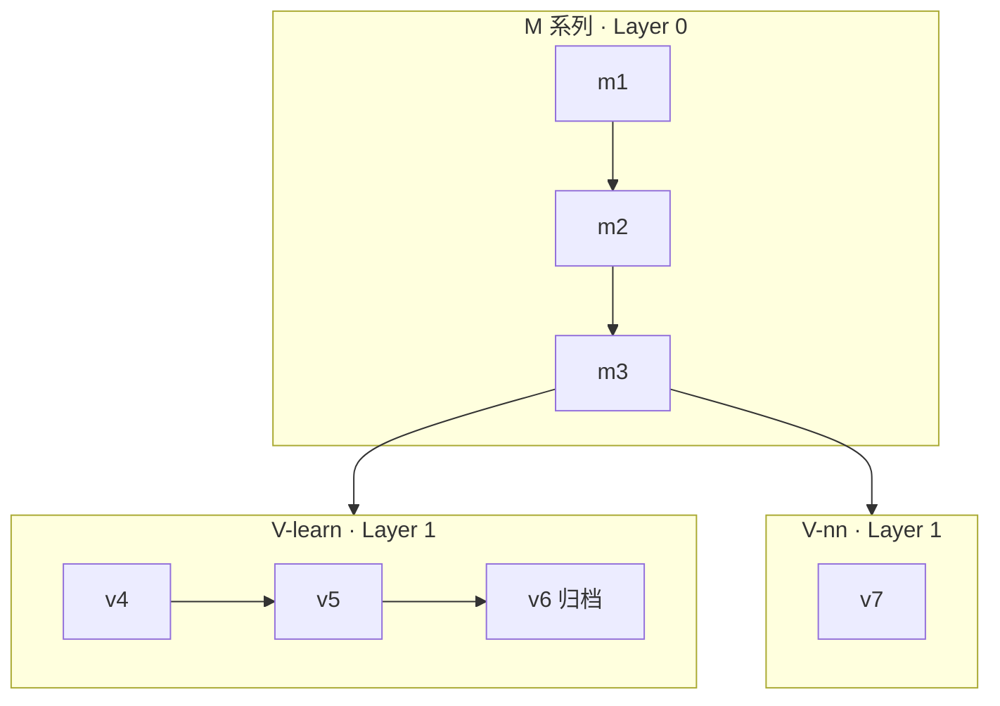

# 掼蛋智能体 M/V 系列仓库治理方案

| 项目 | 内容 |
|------|------|
| 文档版本 | v1.0 |
| 状态 | 已采纳（团队执行基准） |
| 适用范围 | YiFeiAI-GD 仓库全体协作与分支/产物管理 |
| 最后更新 | 2026-05-28 |

---

## 1. 背景与目标

### 1.1 现状

- 仓库同时存在 **M 系列**（平台/工程底座，m1→m2→m3…）与 **V 系列**（智能体/学习范式，v4–v7）两条路径。
- **当前主迭代为 M 系列**，对战对象为 **lalala**，**尚无稳定胜率**，因此 **尚未将 M 能力同步应用到 V 系列**。
- 历史上存在双远程（Gitee `origin`、GitHub `github`）、多分支分叉、根目录脚本与模型/日志进库等问题。

### 1.2 目标

1. **概念清晰**：M = 底座，V = 可插拔智能体；V 内再分「自学」与「神经网络」两条子路径。
2. **协作可执行**：分支、PR、冒烟、产物存放有明文规则。
3. **可复现、可根因**：大文件不进 Git，回归数据与 manifest 可跨机器拉取。
4. **阶段匹配**：在 V 未挂接前，不以 v5 作为改 M 的默认门禁。

---

## 2. 系列定义与依赖关系

### 2.1 M 系列（Platform / 底座）

| 代号 | 定位 | 典型内容 |
|------|------|----------|
| m1 | 最小可参赛：平台连通、双客户端、基础策略 | `yf1_m1.py`、`yf2_m1.py`、通信、回放、lalala 适配 |
| m2 | 工程化：批跑、离线平台、脚本与文档 | `batch_executor/`、`offline_platform/`、`scripts/` |
| m3 | 可复用契约：V 仅依赖稳定接口 | `IDecisionProvider`（或等价契约，待 m3 冻结文档） |
| m4+ | 后续底座代际 | 按 m 代数扩展，不占用 v 版本号 |

**原则**：M 被 V 依赖；V 不得破坏 M 的通信/状态/记录契约。

### 2.2 V 系列（Intelligence / 智能体）

V 系列不是 M 的简单版本号延续，而是 **挂在 M 上的决策与学习实现**。

#### 2.2.1 V-learn（自主学习路径）

| 代号 | 倾向 | 说明 |
|------|------|------|
| v4 | 规则 + 适配 | 偏对接与验证 |
| v5 | 混合决策引擎 + 阶段训练 | 当前自学主线参考实现 |
| v6 | MOE 等实验 | 建议归档分支 `v6-dev`，不纳入 m 日常合并 |

#### 2.2.2 V-nn（神经网络路径）

| 代号 | 倾向 | 说明 |
|------|------|------|
| v7 | 胜率引擎 + 模型推理 | 分支 `v7-dev`，与 v6 **不同阶梯** |



### 2.3 三层物理分类（与 Git 无关）

| 层级 | 名称 | 内容 | 进 Git |
|------|------|------|--------|
| Layer 0 | M-Platform | 通信、状态、客户端壳、批跑、规则骨架 | 是（代码） |
| Layer 1 | V-Intelligence | 决策引擎、训练脚本、适配器 | 是（代码） |
| Layer 2 | Artifacts | 模型权重、全量 replay、训练日志 | **否**（见第 6 节） |

---

## 3. 当前阶段策略（2026-Q2）

| 项 | 约定 |
|----|------|
| 默认开发分支 | **`m1-dev`**（Gitee `origin`） |
| 对战与验收对象 | **lalala** |
| V 系列 | **独立迭代，不阻塞 M**；未达挂接条件前不默认跑 V 全量冒烟 |
| 本地历史 `main` | 视为 **训练/实验归档线**，非日常开发目标 |
| V 默认冒烟 | **OFF**（触发条件见第 7.2 节） |

---

## 4. 分支与远程治理

### 4.1 远程仓库

| 远程名 | 地址角色 | 策略 |
|--------|----------|------|
| **`origin`** | Gitee，**唯一真相源** | 所有功能分支 push 目标 |
| **`github`** | 镜像（**当前暂不维护**） | 日常仅用 `origin`；不删 `develop`、不强制 sync |

### 4.2 分支对照表

| 分支 | 系列 | 角色 | 日常开发 |
|------|------|------|----------|
| **`m1-dev`** | M | 主集成线（m1→m2→m3） | **是** |
| **`v7-dev`** | V-nn | v7 实验 | 仅 V7 相关时 |
| **`v6-dev`** | V-learn | MOE 等归档 | 否（只读参考） |
| **`main`** | 混合/发布 | 稳定快照、少模型 | 否（仅发布/合并） |
| 本地旧 `main` | 历史 | 阶段训练与大文件历史 | 否（已 tag 归档后勿再提交） |
| ~~`develop`~~ | — | Gitee 已删除 | 不恢复 |

版本与状态明细见：[docs/versions/MATRIX.md](../versions/MATRIX.md)。

### 4.3 合并方向

```
v7-dev ──(评审+测试)──► m1-dev ──(里程碑)──► main
v6-dev     ✗ 默认不合并入 m1-dev
```

---

## 5. 目录与命名（目标形态）

### 5.1 对外（短期可保留现有文件名）

- 客户端：`yf1_m1.py`、`yf2_m1.py`、`yf1_v5.py`、`yf1_v7.py` 等。
- PR / Issue 标签：`[M-m2]`、`[V-learn-v5]`、`[V-nn-v7]`、`[artifact]`。

### 5.2 对内（m3 起逐步迁移）

```
src/
  m/                 # M 系列共享与代际代码（目标）
  v/
    learn/           # v4, v5, v6
    nn/              # v7+
  contracts/         # IDecisionProvider 等（m3 冻结）
```

### 5.3 根目录收敛原则

| 现状问题 | 目标 |
|----------|------|
| 根目录大量 `.py` | 迁入 `scripts/` 或 `tools/` |
| `models/*.pth` 进库 | 仅保留说明 + 当前 1～2 个指针；权重走对象存储 |
| `logs/`、`training_logs/` | `.gitignore`，本地或 OSS |
| `game_records/`、`trajectories/` | 归并为 `data/replays/`、`data/trajectories/`（迁移期可并存） |

---

## 6. 产物与对象存储（Artifacts）

### 6.1 原则

- **Git**：仅代码 + `data/manifests/*.json` + 文档。
- **唯一 Artifact 网盘**：**腾讯云 COS**（replay、模型、eval 等大块数据 **只放 COS**，不再使用迅雷等第二套网盘）。
- **本地镜像**：`data/artifacts/` 与桶内目录对应，已 `.gitignore`；换电脑执行 `sync_pull_all` 或 COSBrowser 下载。

### 6.2 存储方案

| 方案 | 说明 |
|------|------|
| **腾讯云 COS** | 唯一真相源；操作见 [COS-接入指南.md](./COS-接入指南.md) |
| **不推荐** | Gitee LFS、Git 内大文件、与 COS 并行的个人网盘 |

### 6.3 对象存储目录规范

```
YiFeiAI-GD-artifacts/
  replays/
    regression-lalala-v1/    # 固定 30 局（见 7.1）
    incidents/               # 单局 RCA
  eval/
    summaries/
  models/
    v-learn/
    v-nn/
```

### 6.4 换电脑标准流程

1. `git clone` + `pip install -r requirements.txt` + 配置 `config/cos.env`
2. **一次拉齐 artifact**：`python scripts/cos/sync_pull_all.py`（或 COSBrowser 打开同一桶）
3. 仅需 regression 时：`python scripts/cos/pull_regression.py`（省流量）

### 6.5 Git 忽略建议（Layer 2）

```
models/*.pth
models/*.pkl
logs/
training_logs/
__pycache__/
.playwright-mcp/
# 大体积 replay 默认忽略，manifest 中登记 OSS 路径
```

---

## 7. 质量门禁与回归

### 7.1 固定回归集（已采纳）

| 项 | 数值 |
|----|------|
| 局数 | **30 局** |
| 构成 | **20 局**当前高频问题局面 + **10 局**历史已修复防回归 |
| 存储 | OSS/COS `replays/regression-lalala-v1/` |
| Git | `data/manifests/regression-lalala-v1.json`（路径、sha256、标签、日期） |
| 更新 | 每解决一类根因，可替换其中 **≤5 局**，总数保持 30 |

**改 M 的 PR（行为相关）**：对这 30 局跑离线 replay/diff；**不要求胜率**；要求无 crash、可产出 diff 报告。

### 7.2 V 默认冒烟开关（已采纳）

**当前状态：`V-default-smoke: OFF`**

满足 **以下任一** 即改为 **ON**（并在 MATRIX 记录启用日期）：

| 条件 | 阈值 |
|------|------|
| **A. 对战门槛** | 对 **lalala** 最近连续 **50 局** 有效对局，**胜率 ≥ 40%** |
| **B. 接口门槛** | **m3 契约文档冻结** 且 **`m1-dev` 上 M 冒烟连续 7 天通过** |

**OFF 时**：改 M 的 PR **不**跑 v5/v7 默认全量决策回归。

**ON 后**：改 M 的 PR = **M 冒烟（30 局）** + **默认 V 薄冒烟**（如 5 局 replay 或 import + `decide` 不 crash）；具体默认 V 版本在 MATRIX 中指定（建议 v5，直至 v7 正式接 m）。

### 7.3 M 冒烟套件（现阶段，替代 v5 默认门禁）

1. 平台/通信：连接与报文正常（如 `verify_websocket_config`）
2. M 客户端：`yf1_m1` / `yf2_m1`（或当前主用 m 客户端）可启动、无 import 错误
3. lalala：短局实战 **或** 30 局离线 replay 回归（推荐后者，稳定）
4. 通过标准：**无异常退出、决策可记录、与基线 diff 可生成**（**不要求**胜率阈值）

### 7.4 V 系列 PR 门禁

- 标签含 `[V-learn-*]` 或 `[V-nn-*]`，目标分支为 `v7-dev` 或约定 V 分支。
- **不得**要求「对 lalala 必须赢」作为 V PR 合并条件（除非该 PR 明确声明对战实验）。

---

## 8. PR 与 Commit 规范

### 8.1 标题前缀（推荐）

```
[M-m2] 修复红桃配保留逻辑
[V-learn-v5] 调整 stage5 评估阈值
[V-nn-v7] 胜率引擎残局分支
[artifact] 更新 regression manifest
[docs] 更新 MATRIX 状态
```

### 8.2 合并检查清单（改 M → `m1-dev`）

- [ ] 通过 **M 冒烟套件**（§7.3）
- [ ] 若行为变更：30 局回归 diff 已跑或 CI 已挂接
- [ ] 未引入大文件进 Git
- [ ] `V-default-smoke: OFF` 时 **未**引入对 v5 的硬性依赖变更（除非 PR 标明 V 联动）

---

## 9. 实施路线图（不改业务逻辑的分阶段）

### Phase 0 — 共识（已完成）

- [x] 采纳本文档与 MATRIX、回归 30 局、V 冒烟双条件、OSS 策略

### Phase 1 — 仓库卫生（1 天）

- [x] `git checkout m1-dev && git pull origin m1-dev`
- [x] 本地 `main` 打归档 tag `archive/main-pre-governance-20260528`，日常不在 `main` 提交
- [x] `git fetch origin --prune`
- [ ] ~~`git fetch github --prune` / 删 develop~~ → **GitHub 暂不处理**
- [ ] ~~GitHub 远程 `develop` 删除~~ → **暂不处理**（仅用 Gitee `origin` 为真相源）
- [x] 确认 `credential.helper=manager`

### Phase 2 — 文档与 manifest（1 天）

- [x] 维护 `data/manifests/regression-lalala-v1.json`（模板）
- [ ] 上传 30 局至 COS（待配置 `config/cos.env`）
- [x] README 增加治理 / COS 链接

### Phase 3 — `.gitignore` 与清单（2–3 天）

- [x] 收紧 `models/`、`logs/`、`training_logs/`、`data/artifacts/`
- [x] 编写 `docs/repo-cleanup-inventory.md`（根目录脚本归类，待迁移）

### Phase 4 — 代码收敛（多 PR，按需）

- [ ] 根目录脚本 → `scripts/`
- [ ] deprecated 标记 v4/v5_stage5 客户端
- [ ] m3 `contracts/` 与目录 `src/m/`、`src/v/` 渐进迁移
- [ ] v7 评审通过后合并 `v7-dev` → `m1-dev`

---

## 10. 相关文档

| 文档 | 说明 |
|------|------|
| [docs/versions/MATRIX.md](../versions/MATRIX.md) | 版本/分支/冒烟状态矩阵 |
| [data/manifests/regression-lalala-v1.json](../../data/manifests/regression-lalala-v1.json) | 30 局回归清单模板 |
| [docs/governance/COS-接入指南.md](./COS-接入指南.md) | COS 配置与上传/拉取命令 |
| [docs/governance/分析接续-handoff.md](./分析接续-handoff.md) | 换机 / 新 Agent 如何接续分析 |
| [docs/掼蛋AI客户端架构方案.md](../掼蛋AI客户端架构方案.md) | 模块级架构（需与本文 M/V 分层对齐） |
| [docs/GIT_SETUP_GUIDE.md](../GIT_SETUP_GUIDE.md) | Git 操作（待与 §4 同步修订） |

---

## 11. 修订记录

| 版本 | 日期 | 说明 |
|------|------|------|
| v1.0 | 2026-05-28 | 首版：M/V 分层、分支、OSS、回归 30 局、V 冒烟双条件、现阶段 M-only 门禁 |
