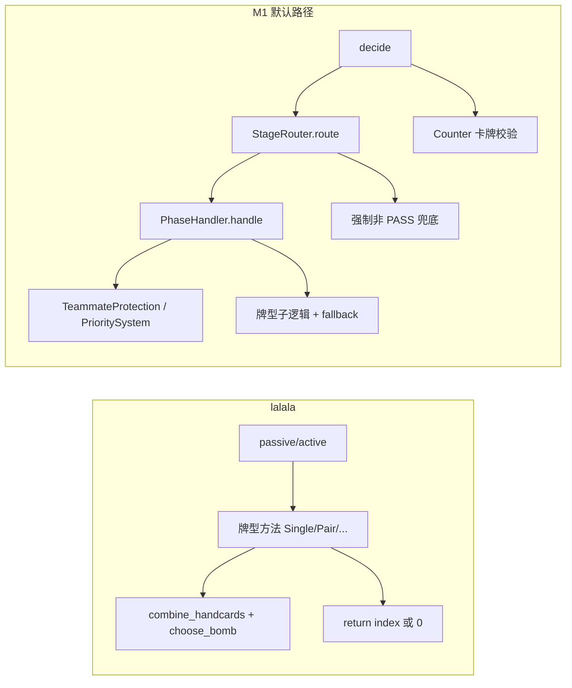

# Cursor 评审：M1 vs lalala 硬编码规则引擎技术路径（对 opencode 分析的复核）

**评审对象**：`docs/guandan-brain/reviews/M1_vs_lalala_TECHNIQUE_opencode.md`  
**评审日期**：2026-05-21  
**评审方法**：通读 opencode 全文；对照必读源码逐段核验行号；`rg` 交叉验证关键符号；独立补充架构与行为差异判断  

**必读源码清单**

| 文件 | 路径 | 行数（实测） |
|------|------|-------------|
| opencode 分析稿 | `docs/guandan-brain/reviews/M1_vs_lalala_TECHNIQUE_opencode.md` | 291 |
| lalala 决策 | `docs/competition/lalala/lalala_src/action.py` | 1411 |
| lalala 工具 | `docs/competition/lalala/lalala_src/utils.py` | 769 |
| M1 入口 | `src/decision/rule_based_decision_engine_m1.py` | 254 |
| M1 路由/基类 | `src/decision/stage_router.py` | 593 |
| M1 策略引擎 | `src/decision/strategy_engine.py` | 589 |
| M1 阶段处理器 | `src/decision/phase_handlers.py` | 2773 |

---

## 一、总评结论

### 1.1 opencode 分析是否准确？

**判定：方向正确、论据扎实，约 75–80% 的核心论断经源码核对成立。**

opencode 对以下结构性判断是准确的：

1. **规则嵌入范式不同**：lalala 按牌型内嵌 if-return；M1 按「阶段 × 动静」分层 + 策略引擎打分（§2 架构描述正确）。
2. **决策维度缺口真实**：M1 的 `src/decision/` 目录内**不存在** `pass_num`、`my_pass_num`、`numofnext`、`numofgreaterPos` 等 lalala 核心变量（全目录 `rg` 零匹配）；`pass_count` 仅从 message 透传到 context（`stage_router.py:422`），且 `ContextPriorityAdjuster._reduce_single_priority()` 为空实现（`strategy_engine.py:400-403`），与 lalala `Single()` 中 `pass_num >= 5 or my_pass_num >= 3`（`action.py:161-164`）不在同一量级。
3. **炸弹择优缺口真实**：lalala `choose_bomb()` 有完整评分链（`utils.py:297-367`）；M1 默认 `PrioritySystem` 对 Bomb 主要是阶段禁用/低分（`strategy_engine.py:511-525`），无「最小代价炸弹排序」。
4. **主动出牌链缺口真实**：lalala `active()` 是手牌结构驱动的优先级链（`action.py:1113-1181`）；M1 主动路径依赖固定 `base_priority` 字典（`strategy_engine.py:444-464`）+ `PrioritySystem.select()`（`strategy_engine.py:425-439`）。
5. **代码重复与分层成本真实**：`_handle_single_passive` 在 `OpeningPassiveHandler`（`phase_handlers.py:576-834`）与 `MidEarlyPassiveHandler`（`phase_handlers.py:1307+`）等处重复；样板代码（context 构建、候选过滤、`_validate_action_cards`）在 `phase_handlers.py` 内出现 **44 次** `_validate_action_cards` 调用。

**需修正的绝对化表述**：

| opencode 表述 | 问题 | 更准确的说法 |
|--------------|------|-------------|
| 「lalala 技术路径更优」 | 忽略 M1 在可观测性、ProtectionRule 插件化、阶段化场景上的优势 | **决策规则嵌入与牌型细粒度：lalala 明显领先；工程容器与扩展机制：M1 有结构优势但未转化为决策质量** |
| 「M1 基本缺失炸弹策略」 | 未区分默认路径 vs 增强路径 | M1 **缺失 lalala 式 `choose_bomb` 最小代价选择**；`TeammateProtectionStrategy`（`strategy_engine.py:283-306`）、`EnhancedPrioritySystem`（配置启用，`stage_router.py:54-66`）有简化 Bomb 逻辑，但不等价 |
| 「M1 `_handle_single_passive` 仅有 rank 比较」 | 低估了 M1 已有启发式 | M1 另有 excess_singles（`phase_handlers.py:647-665`）、拆 10+ 对子（`phase_handlers.py:667-708`）、残局级牌/王（`phase_handlers.py:710-729`）等路径，但仍缺 lalala 的位置/pass 组合条件 |
| 日志/验证占比 ~40% | 无实测口径 | logger 调用约 **181 次**/2773 行（~6.5%）；若含 validation + fallback 样板，**约 15–25%** 更合理，40% 偏高 |

### 1.2 opencode 遗漏了什么？（Cursor 独立发现）

以下遗漏对「追赶 lalala」优先级影响不低于 opencode 已列的五项差距：

#### 遗漏 A：`StageRouter` 强制非 PASS 兜底（行为级差异，非 mere 工程细节）

```496:519:src/decision/stage_router.py
                # ⚠️ 最终防线：无论handler返回什么，只要有非PASS动作就强制返回第一个非PASS动作
                if is_pass:
                    ...
                        for i in range(1, len(action_list)):
                            action = action_list[i]
                            if isinstance(action, list) and len(action) > 0 and action[0] != "PASS":
                                ...
                                return i
```

lalala 大量场景**策略性 return 0（PASS）**（如队友 leading 时 `action.py:137-139`、高牌让权 `action.py:82-85`）。M1 在 handler 返回 PASS 后仍可能被路由层改写为「第一个非 PASS 动作」，**直接抵消** lalala 式让牌逻辑。opencode 全文未提此机制——这是 M1 决策质量可能低于 lalala 的**独立根因**，而非仅「规则不够细」。

#### 遗漏 B：队友保护的双轨制与语义冲突

- lalala：保护逻辑**内嵌**于 `Single()/Pair()/...` 的 `greaterPos == teammate` 分支（例：`action.py:137-155`）。
- M1：`OpeningPassiveHandler.handle()` 在牌型 dispatch **之前**调用 `TeammateProtectionStrategy.get_protection_action()`（`phase_handlers.py:454-458`），另有 handler 级 `is_teammate` 粗粒度判断（`phase_handlers.py:487-506`），再进入 `_handle_single_passive`。

两套语义未对齐：lalala 在队友 leading 且 `curVal <= 10` 时仍可能跟牌（`action.py:144-145`）；M1 开局队友出牌时倾向直接 PASS（`phase_handlers.py:498-501`），但路由层兜底又可能强制出牌（遗漏 A）。**移植 lalala 规则前必须先统一「谁有权决定 PASS」。**

#### 遗漏 C：M1 存在未接入 M1 主路径的平行架构

`card_type_handler_factory.py` / `decision_engine.py` 中有按牌型 dispatch 的 `CardTypeHandlerFactory`（例：`BombHandler.handle_passive()` `card_type_handler_factory.py:497-535`），但 **`RuleBasedDecisionEngineM1` 不经过该工厂**，而是 `phase_handlers.py` 五阶段 handler。opencode 将 M1 等价于 phase_handlers 路径是对的，但未说明仓库内存在**两套决策架构**，易造成「已有 BombHandler 为何还说缺失」的困惑。

#### 遗漏 D：手牌分析能力被低估，但与 lalala 启发式不对齐

M1 通过 `HandStructureAnalyzer` + `OptimalCombinationScanner`（`stage_router.py:48-74`，扫描入口 `stage_router.py:147-155`）实现了类似 `combine_handcards` 的结构化分析，并产出 `excess_singles`、`protected_combinations`、`action_evaluations`。这是 M1 相对 lalala 的**潜在优势**，但当前主动决策仍主要走固定分数 `PrioritySystem`，扫描结果 mostly 用于过滤/优先 excess_singles，**未形成 lalala `rankthree()`/`rankfour()` 级别的动态牌型比较**（`utils.py:610-687` 一带）。opencode 自评提到但未纳入主文差距分析。

#### 遗漏 E：lalala 自身的技术债（对等视角缺失）

- `active()` 两手出完检测 `actionList[i][-1].sort(...)` 返回 `None`，比较恒失败（`action.py:1124-1127`）——该路径在 lalala 中可能从未生效。
- 多处 `random()` 决定是否出炸（`action.py:167-171`、`action.py:321-326`）——不可复现、不利 eval 对比。
- 大量 `print()` 调试输出（`action.py:979`、`action.py:1109`）。

opencode 只强调 lalala「规则密度高」，未讨论**可维护性与可测试性**代价；公平对比应承认 lalala 也不是无缺陷的「黄金标准实现」。

#### 遗漏 F：接口/状态字段差异

| 维度 | lalala | M1 |
|------|--------|-----|
| 各家剩余牌数 | `history[i]["remain"]` → `numofplayers`（`action.py:1361`） | `publicInfo[i]["rest"]` → `cards_left`（`stage_router.py:382-385`） |
| 连续 PASS | `pass_num` / `my_pass_num` 参数贯穿（`action.py:37`） | 仅 `pass_count`（`stage_router.py:422`），且 adjuster 未实现 |
| 被动入口 | `curAction[0]=="PASS"` 时用 `greaterAction`（`action.py:978-979`） | 复杂 curAction 解析 + `_is_passive_play()`（`stage_router.py:553-592`） |

移植 lalala 规则时，**必须先做 context 字段对齐**（opencode 建议 2 提到移植参数，但未强调 M1 当前 message 管线是否供给 `pass_num`——主分支 `src/decision/` 未接线）。

---

## 二、逐节准确性验证（含行号引用）

### §2 规则嵌入路径

| opencode 论断 | 源码核对 | 结论 |
|--------------|---------|------|
| lalala `Single()` 37-179 完整被动单张 | `action.py:37-179` | ✅ |
| lalala `passive()` 964-1019 仅 dispatch | `action.py:964-1019`（`Single`→`Bomb` 七路分支 `988-1017`） | ✅ |
| lalala `active()` 1093-1183 优先级链 | `action.py:1093-1183` | ✅ |
| M1 `decide()` 158-229 入口 + Counter 校验 | `rule_based_decision_engine_m1.py:158-229`（校验 `202-223`） | ✅ |
| M1 `route()` 464-538 | `stage_router.py:464-538`（handler dispatch `488-493`） | ✅ |
| M1 `OpeningActiveHandler` → `_build_structure_strategy` | `phase_handlers.py:50-77`、`116-362` | ✅ |
| M1 `OpeningPassiveHandler` teammate + dispatch | `phase_handlers.py:387-534` | ✅ |

**行号微差**：opencode 写 Pair 示例 `L228: curVal>=12 && numofnext!=2`，实际在 `action.py:230`（差 2 行，不影响论点）。

### §3 差距 1 — 规则精确度

**lalala 侧（opencode 准确）**

```81:85:docs/competition/lalala/lalala_src/action.py
        if numofnext <= 4 or (numofpre <= 3 and numofpre>=1):
            if (myPos+2)%4 == greaterPos and curVal >= max_val:
                return 0
            if (myPos+2)%4 == greaterPos and curVal>=15 and numofnext!=1:
                return 0
```

```161:177:docs/competition/lalala/lalala_src/action.py
                if pass_num >= 5 or my_pass_num >= 3:
                    index = special(single_actionList, bomb_member, straight_member, rank_card)
                    ...
                cur_bomb_num = cal_bomb_num(sorted_cards, handcards, rank_card)
                if curVal >= max_val and numofgreaterPos >= 15 and cur_bomb_num > 1:
                    p = random()
                    index = choose_bomb(...)
```

**M1 侧（opencode 部分准确，需补充）**

```618:708:src/decision/phase_handlers.py
        is_upper_hand = (greater_pos == (my_pos - 1) % 4) or (greater_pos == (my_pos + 3) % 4)
        ...
                                            if action_rank_value > cur_rank_value:
                                                logger.info(f"拆{preferred_rank}对子压制: ...")
                                                return i
```

- ✅ M1 缺少 `numofnext` / `pass_num` / `cur_bomb_num` / `numofgreaterPos` 组合——**成立**。
- ⚠️ M1 并非「只有 rank 比较」：excess_singles、拆对、级牌/王路径见 `phase_handlers.py:642-729`。
- ⚠️ opencode 引用 `phase_handlers.py:814-829` 兜底逻辑——**准确且应强调风险**：

```816:829:src/decision/phase_handlers.py
        if is_opponent_high_card:
            ...
                for i, action in enumerate(action_list):
                    if ... action[0] != "PASS":
                        if self._validate_action_cards(action, handcards):
                            return i
```

这是「压不住也强行出第一张合法牌」，比 lalala 的精细 PASS **更激进**，与 opencode「无精细分级」一致，但性质是 **M1 独有劣化策略**，不是单纯「缺失」。

### §3 差距 2 — 炸弹策略

**lalala（opencode 准确）**

```315:367:docs/competition/lalala/lalala_src/utils.py
            if action[1]==rank_card[1]:
                ...
                bomb_res.append((index, new_card_val[action[1]] + (l - 4) * 16+prior))
            ...
        elif action[0] == "StraightFlush":
            ...
                    bomb_res.append((index, new_card_val[action[1]] + 32))
    ...
        bomb_res = sorted(bomb_res, key=lambda item: item[1])
        return bomb_res[0][0]
```

**M1（opencode 准确，补充 Enhanced 路径）**

```511:525:src/decision/strategy_engine.py
            if action_type_lower == 'bomb' and is_active:
                ...
                if my_rest > 15:
                    score = 0
                elif my_rest > 10:
                    score = 20
                else:
                    score = priority_map.get('bomb_active', 50)
```

`MidEarlyPassiveHandler` 在对手对子场景下可能直接 `return i` 选第一个 Bomb（`phase_handlers.py:1521-1526`），**无** lalala 式 `choose_bomb` 代价比较。

### §3 差距 3 — 主动出牌

**lalala（准确）**：`action.py:1129-1181` 链式 `getindex` → `rankfour` → 顺子 → `rankthree` → `rankone` → `ranktwo` → `numofnext==1` 特判。

**M1（准确）**：

```444:505:src/decision/strategy_engine.py
        return config.get("priority_rules", {
            'active': {
                'one_hand_complete': 1000,
                ...
                'single': 200,
```

```496:505:src/decision/strategy_engine.py
            if len(candidate[2]) == len(handcards):
                scores.append(float(priority_map.get('one_hand_complete', 1000)))
            ...
                if card_count >= len(handcards) * 0.7:
                    scores.append(float(priority_map.get('two_hand_complete', 900)))
```

另：`OpeningActiveHandler` **显式跳过**开局一手出完检查（`phase_handlers.py:73-74`），与 lalala `active()` 首行检查（`action.py:1113-1115`）相反——opencode 未单独指出。

### §3 差距 4 — one_hand

| 实现 | 位置 | 特征 |
|------|------|------|
| lalala `one_hand()` | `utils.py:369-411`；`passive()` 调用 `action.py:981-986` | 集中；含 `max_bomb` / 队友炸弹条件 |
| M1 `_check_one_hand_complete` | `stage_router.py:88-93` | 仅牌数相等 |
| M1 `_check_two_hand_complete` | `phase_handlers.py:1168-1209`（MidEarly）；`1817+`（MidLate 重复） | 无 `max_bomb`；无队友 leading 特判 |

opencode 论断 ✅；补充：M1 两手出完在 `len(handcards) <= 10` 才触发（`phase_handlers.py:1170`），lalala `passive` 在 `numofmy <= 10`（`action.py:981`）——阈值接近但语义不同。

### §3 差距 5 — 代码量

| 口径 | opencode | Cursor 实测 |
|------|----------|-------------|
| M1 四文件 | ~3600+ | **4209**（589+2773+593+254） |
| lalala 核心 | ~770 | action 1411 + utils 769 = **2180 全文件**；若仅 `choose_bomb`+牌型方法约 **900–1100** |
| `_validate_action_cards` | handler 内大量 | phase_handlers **44** 处 |

---

## 三、独立技术判断（Cursor）

### 3.1 架构取舍：不是「谁更工程化」，而是「规则在哪里生效」



**判断**：

1. M1 的分层在「加 ProtectionRule、加阶段 handler、加日志」上有真实收益（`strategy_engine.py:125-149` GUA-022 是 lalala 没有的正向演进）。
2. 但 M1 把**本应一体的牌型决策**拆成「阶段 handler + 固定分数 + 路由兜底」，导致 lalala 一条 if 链被拆成 3–4 处弱耦合逻辑，**规则密度必然下降**——这与 opencode「过度工程化」判断一致，但根因是 **决策路径过长 + 兜底策略破坏 PASS**，不仅是文件多。
3. **最优路线不是推翻 M1 文件结构，而是把 lalala 牌型内核嵌入 M1 容器**：保留 `StageRouter` 阶段划分与 `ProtectionRule` 插件，用 lalala 式方法替换 `PrioritySystem.select()` 与分散的 `_handle_*_passive`。

### 3.2 决策质量差距的优先级排序（Cursor 视角）

| 优先级 | 缺口 | 理由 |
|--------|------|------|
| **P0** | 禁用或条件化 `StageRouter` 强制非 PASS（`stage_router.py:496-534`） | 不修复则移植 lalala PASS 规则无效 |
| **P0** | 引入 `choose_bomb` + context 补齐 `pass_num`/`numofnext`/`numofgreaterPos` | 独立可测；被动压制核心 |
| **P1** | Single/Pair 被动 lalala 化 + 与 `TeammateProtectionStrategy` 去重 | 单牌型 ROI 最高、出现频率最高 |
| **P1** | `active()` 优先级链替换 `base_priority` | 影响面大，需 eval 门禁 |
| **P2** | 合并重复 `_handle_single_passive` / `_check_two_hand_complete` | 降维护成本 |
| **P3** | 精简 `_validate_action_cards` 调用点 | 最后做；M1 从 actionList 选题，验证仍有价值 |

### 3.3 对 opencode §5 追赶建议的评审

| 建议 | 评价 |
|------|------|
| **建议 1** 删除 `_calculate_base_scores`，改 lalala 优先级链 | ✅ 方向对；应**按阶段注入不同 `cur[]` 阈值**（lalala `action.py:1100` 硬编码），而非完全删除阶段概念 |
| **建议 2** 基类 `_lalala_single_passive` 移植 | ✅ 正确；**必须先**处理 StageRouter PASS 兜底与 TeammateProtection 冲突 |
| **建议 3** `lalala_compat.py` 移植 `combine_handcards` + `choose_bomb` | ✅ **最高 ROI**；M1 已有 scanner 可复用 combiner，但应用层需显式调用 `choose_bomb` |
| **建议 4** 模板方法 `_active_decision` | ⚠️ 与建议 1–3 **顺序颠倒**；规则未对齐前做抽象会固化错误结构 |
| **建议 5** 删除 handler 内验证 | ❌ **高风险**；应改为「单点验证 + warn」（`rule_based_decision_engine_m1.py:202-223` 已存在），而非删除——M1 有 `_default_passive_action` 强制 fallback（`phase_handlers.py:816-829`），验证是最后一道防线 |

---

## 四、扩充性分析（在 opencode §4 基础上扩展）

### 4.1 opencode 扩充性表格评审

opencode §4.3 五场景评分**方向合理**，但缺少三个对长期迭代关键的维度：

| 场景 | lalala | M1（默认） | M1（理想：lalala 内核 + M1 容器） |
|------|--------|-----------|----------------------------------|
| 已有牌型规则细化 | ★★★★☆ | ★★☆☆☆ | ★★★★☆（若规则集中在牌型模块） |
| 加新牌型 | ★★★☆☆ | ★★☆☆☆ | ★★★☆☆ |
| 加新阶段/场景 | ★☆☆☆☆ | ★★★☆☆ | ★★★★☆ |
| 加协作/保护策略 | ★☆☆☆☆ | ★★★★☆ | ★★★★☆ |
| **决策可复现 / eval** | ★★☆☆☆（random） | ★★★☆☆ | ★★★★☆ |
| **PASS 语义一致性** | ★★★★☆ | ★☆☆☆☆（路由兜底破坏） | ★★★★☆（修复兜底后） |
| **回归可测性** | ★★☆☆☆ | ★★★★☆（日志+验证） | ★★★★★ |

### 4.2 lalala 扩充性（独立判断）

**优势**

- 新规则 = 在对应牌型方法加分支，无跨文件注册（`action.py:988-1017` dispatch 仅 7 路 if-elif）。
- 规则与返回值同屏，调试时可 print index（虽不规范）。

**瓶颈**

- 条件组合爆炸时嵌套深度无约束（`Single()` 已含闭包 `normal`/`special` + 外层 4 维位置，`action.py:119-177`）。
- 无统一优先级框架：改 `active()` 链顺序（`action.py:1129-1158`）可能意外影响全局。
- 八牌型 × 相似样板（`combine_handcards` 重复块 `action.py:45-62` 等在 Pair/Trips 重复）——**横向扩展快，纵向一致性难**。

### 4.3 M1 扩充性（独立判断）

**优势**

- `ProtectionRule` 插件（`strategy_engine.py:16-22`、注册 `188-194`）——加协作策略无需改八个 handler。
- 五阶段 handler：残局/开局可分叉（`stage_router.py:540-551`）——lalala 用 `numofnext<=4` 等条件隐式表达阶段，M1 显式化。
- 配置切换 Enhanced 模块（`stage_router.py:33-66`）——A/B 友好。

**瓶颈**

- 新牌型需改：`action_type_mapping`（`strategy_engine.py:474-484`）+ `base_priority` + 多个 handler 的 dispatch + 可能重复 `_handle_*_passive`。
- 每个 handler ~200 行样板（OpeningActive `_build_structure_strategy` `phase_handlers.py:116-362` 即 246 行）。
- **平行架构**（`decision_engine.py` + `CardTypeHandlerFactory` vs `phase_handlers`）增加认知负担——新开发者易改错文件。

### 4.4 综合扩充性结论

- **短期追决策质量**：lalala 式内嵌规则 wins；M1 框架是「壳」，不是「脑」。
- **中长期团队协作 / 多策略试验**：M1 容器 + lalala 牌型内核 **> 纯 lalala 复制粘贴**。
- opencode「lalala 不适合引入新决策维度」略绝对——M1 同样未接线 `pass_num`，**不是架构不能，是当前实现未做**。

---

## 五、对 opencode 核心结论的最终裁定

| 维度 | 裁定 |
|------|------|
| 分析整体可信度 | **高**（静态代码层面） |
| 「lalala 路径更优」 | **在决策质量目标下成立**；在工程扩展性上需限定语境 |
| 行号引用 | **基本精确**（个别 ±2 行） |
| 最大遗漏 | **`StageRouter` 强制非 PASS**、**双轨队友保护冲突**、**M1 平行架构**、**context 字段未接线** |
| 最大偏误 | **低估 M1 已有子策略**；**高估日志占比**；**建议 5 风险未充分警示** |

**一句话总结**：opencode 正确识别了「M1 缺 lalala 级牌型内嵌规则」这一主矛盾；若只读 opencode 而不读 `stage_router.py:496-534`，会**高估**「把 lalala 贴进 handler 就能追上」——必须先修复 PASS 语义与 context 维度，否则移植后行为仍偏离 lalala。

---

## 六、开放问题（建议下一轮验证）

1. **场景对照表**：同一 `(handCards, curAction, publicInfo, pass_num)` 下，lalala `Single()` vs M1 `OpeningPassiveHandler` + 路由兜底，决策 index 差异率多少？
2. **最小补丁 eval**：仅 P0（禁用强制非 PASS + `choose_bomb`）vs 全量移植 Single/Pair，哪个胜率提升更大？
3. **`OptimalCombinationScanner.action_evaluations` 能否替代 `rankthree()`**，还是应直接移植 utils 函数？
4. M1 message 管线能否从 `card_tracking` / 通信层接入 `pass_num`（仓库其他路径如 `yf2_v5.py` 已有，`grep` 可见）？

---

## 七、置信度自评

**置信度：83%**

| 依据 | 权重 |
|------|------|
| 通读 opencode 291 行 + 必读 6 文件核心路径 | 高 |
| 关键符号 `rg` 全目录验证（pass_num/choose_bomb 等） | 高 |
| 行号抽样 20+ 处逐段对照 | 高 |
| `phase_handlers.py` 2773 行未逐行精读（重复 handler 仅抽样 2 处） | 降权 |
| 未跑对战 eval / 无场景 diff 测试 | 降权 |
| `EnhancedPrioritySystem` / `EnhancedCollaborationStrategy` 仅读接口与 grep，未全文件精读 | 降权 |
| lalala `back_action` / `tribute` 未与 M1 `TributeHandler`/`BackHandler` 对比 | 降权 |

**较 opencode 自评 85%**：本评审多发现 **StageRouter PASS 兜底** 与 **context 接线缺口** 两处高影响遗漏，但对 Enhanced 模块与全量 handler 重复体的覆盖仍有限，故略低于 opencode 自述置信度，而**主结论方向与之一致**。

---

*评审人：Cursor Agent（composer-2.5-fast）*  
*输出路径：`docs/guandan-brain/reviews/M1_vs_lalala_TECHNIQUE_cursor.md`*
