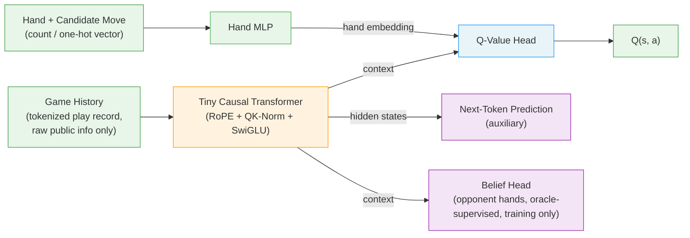

# FableDan — A Feature-Free GuanDan AI Trained by Self-Play RL

FableDan is a from-scratch training framework for **GuanDan (掼蛋)**, a popular
four-player, two-team trick-taking card game. It learns to play entirely from
the **raw, tokenized game history** — who played what, in order — with **no
hand-crafted features and no domain-specific priors**. A tiny Llama-style
causal Transformer reads the play-by-play transcript and a Q-head scores each
legal move, trained by Deep Monte-Carlo (DMC) self-play.

The whole pipeline is here: rules engine, tokenizer, the PyTorch training model,
a dependency-free NumPy inference model, the DMC self-play trainer, an evaluation
harness, and a ready-to-submit [Botzone](https://www.botzone.org.cn/) bot.

> **Note.** This is a research/hobby project built to compete on the Botzone
> GuanDan ladder. The code is extensively tested (see `tests/`) but may still
> contain bugs. Final ladder standing depends mostly on how much compute and
> wall-clock time you put into training — see *Honest expectations* below.

---

## Key idea

Most strong card-game agents (DouZero, DanZero, PerfectDou, Suphx, …) rely on
**carefully engineered state features** that bake in a lot of domain knowledge —
pre-computed statistics, remaining-card bookkeeping, and other "secondary"
information.

FableDan follows the direction popularized by **DanLM** — *let the raw game
history speak for itself*. The model input is simply:

1. the **tokenized play history** (a short vocabulary of ~48 tokens: players,
   move types, claimed ranks, tribute/return events), and
2. a small **count/one-hot vector** for the current hand and the candidate move.

Everything that matters — card counting, who is dangerous, when to drop a bomb —
is learned from scratch through self-play and an auxiliary next-token-prediction
objective.

| Aspect            | Hand-crafted SOTA (e.g. DanZero) | FableDan                       |
| ----------------- | -------------------------------- | ------------------------------ |
| State features    | hundreds of hand-crafted dims    | raw token sequence (~48 vocab) |
| Encoder           | MLP                              | tiny causal Transformer + MLP  |
| Domain knowledge  | yes                              | no                             |
| Training signal   | DMC self-play                    | DMC self-play + NTP (+ belief) |

---

## Architecture



- **Encoder**: a small (default 4-block) Llama-style causal Transformer
  (`d_model=128`, RoPE positional encoding, QK-Norm, RMSNorm, SwiGLU FFN) over
  the history token stream. The last-position hidden state is the context vector.
- **Hand MLP**: encodes the per-move count/one-hot feature vector.
- **Q-head**: concatenates context + hand embedding and regresses a scalar
  Q-value for each legal move; greedy action = argmax Q.
- **Auxiliary heads (training only, dropped at inference):**
  - **Next-token prediction (NTP)** over the history, as in DanLM.
  - **Belief head** — predicts the three other players' hidden hand
    rank-counts from oracle labels. This nudges the encoder to learn precise
    card counting (a light-weight take on Suphx oracle-guiding /
    PerfectDou perfect-information distillation). DanLM does not use this.

Inference is a **pure-NumPy reimplementation** (`fabledan/model_np.py`) that
mirrors the trained weights, so deployment has **zero heavy dependencies** and
runs comfortably inside Botzone's sandbox.

---

## Repository layout

```
fabledan/
  cards.py        Card encoding (Botzone ids 0..107), level-card ordering
  combos.py       Move enumeration (incl. wildcard "配子" usage), beats(), claim parsing
  engine.py       Single-round engine: deal/tribute/return/resist/接风/double-down, rewards ±1/±2/±3
  encode.py       History tokenizer (vocab 48) + hand/action features
  model_torch.py  PyTorch Q-network (training; Transformer + MLP + NTP + belief heads)
  model_np.py     Pure-NumPy inference model (deployment / fast eval)
  ring.py         RingRunner: many concurrent rounds, batched decision requests
  train_fast.py   DMC self-play trainer (CPU actors + batched GPU inference + GPU learner)
  train.py        Replay buffer + single-process training utilities
  train_demo.py   Tiny NumPy MLP DMC trainer (validate the pipeline with no PyTorch)
  agents.py       Random / Rule / Torch / NumPy agents
  evaluate.py     Head-to-head evaluation (team seat-swap, random level/tribute)
botzone/
  bot_fabledan.py Botzone bot entry (JSON protocol, NumPy inference)
  local_judge.py  Local Botzone judge simulator for protocol/legality testing
  pack_bot.py     Package the submission zip
tests/
  test_all.py     Engine invariants, claim round-trip, encoding, RingRunner smoke tests
```

> Trained weights, checkpoints, packaged zips, and reference papers are **not**
> tracked in git (see `.gitignore`). Train your own with the commands below.

---

## Installation

```bash
# Inference / evaluation / Botzone bot only:
pip install numpy

# Training (PyTorch model):
pip install torch numpy
```

Python 3.10+ is recommended. Training benefits greatly from a CUDA GPU; the
NumPy demo trainer and all inference run fine on CPU.

---

## Quick start

Run everything from the repository root.

```bash
# 1. Sanity tests (engine invariants, claim round-trip, encoding, RL loop)
python tests/test_all.py

# 2. Train a tiny NumPy MLP via DMC self-play — no PyTorch needed, validates
#    the full pipeline end-to-end (a few thousand rounds reaches ~80-90% vs random)
python -m fabledan.train_demo

# 3. Evaluate any two agents head-to-head (seat-swapped, random level/tribute)
python -m fabledan.evaluate --a rule   --b random --games 200
python -m fabledan.evaluate --a ckpts/run1/best.npz --b rule --games 500
```

`--a` / `--b` accept `random`, `rule`, an `*.npz` (NumPy) or `*.pt` (PyTorch)
checkpoint.

---

## Full training (PyTorch, GPU)

`train_fast` mirrors the DanLM-style setup: CPU actor processes run many rounds
concurrently and ship batched decision requests to a dedicated GPU inference
server, while a learner process does the gradient updates and broadcasts fresh
weights every cycle.

```bash
# Single GPU
python -m fabledan.train_fast --out ckpts/run1 --actors 16

# Two GPUs (one serves inference, one trains) — like DanLM
python -m fabledan.train_fast --out ckpts/run1 --actors 24 \
    --infer-device cuda:0 --device cuda:1

# Resume from a checkpoint
python -m fabledan.train_fast --out ckpts/run1 --resume ckpts/run1/latest.pt
```

Useful flags: `--n-blocks` (encoder depth, default 4), `--ntp-weight`
(default 0.02), `--belief-weight` (default 0.05, `0` to disable), `--batch`,
`--actors`, `--max-decisions` (GPU batch size), `--max-hours` (auto-stop +
final export). Whenever evaluation hits a new high, the trainer auto-exports a
NumPy `best.npz` and packs a ready-to-upload Botzone zip.

The trainer reports two signals: **win-rate vs the rule baseline** (saturates
early) and **win-rate vs a frozen self-snapshot** — once the rule win-rate
plateaus, the snapshot number is the trustworthy "still getting stronger" gauge.

---

## Deploy to Botzone

See [UPLOAD_GUIDE.md](UPLOAD_GUIDE.md) for the full step-by-step. In short:

```bash
# Embed weights in the zip (simplest, if within the source-size limit)
python botzone/pack_bot.py --weights ckpts/run1/best.npz --embed-weights
# -> dist/fabledan_bot.zip   (upload as a python3 bot on the GuanDan game)
```

The bot is dependency-free (NumPy only, which Botzone provides), uses the JSON
protocol, supports long-running mode, and loads weights once on the first turn.
Measured single-decision inference is ~20–40 ms, well inside the per-turn limit.

---

## What FableDan adds on top of the baseline recipe

The DanLM-style recipe is *raw-history tokenization + a tiny Transformer + DMC
self-play + NTP*, plus a lot of compute. FableDan keeps that and adds a few
things aimed at squeezing more out of every sample; see [DESIGN.md](DESIGN.md)
for the full roadmap.

- **Belief auxiliary head** — oracle-supervised opponent-hand prediction,
  forcing the encoder to learn precise card counting (already implemented,
  default on).
- **Slightly deeper encoder** (4 blocks) with QK-Norm + RoPE + SwiGLU.
- **Top-k ε-greedy exploration** — explore only among the model's best moves,
  never obviously bad ones.
- **Frozen-snapshot shadow evaluation** to detect self-play stagnation.

Planned / scaffolded: TD-λ mixed targets to reduce DMC variance, an opponent
pool / league to avoid exploitative collapse, deploy-time one-step look-ahead
search using the belief head, and model scaling + distillation.

---

## Honest expectations

The architectural ideas amplify the value of each sample, but the hard currency
of self-play RL is still **compute × time**. Reaching a DanLM-scale amount of
experience takes serious GPU-days. A realistic cadence: train for a day or two,
upload the first version once it clears ~95% vs the rule baseline to get an
initial ladder placement, then keep training and re-uploading. Treat it as an
ongoing process rather than a one-shot submission.

---

## References

- **DanLM** — Tokenization-based, feature-free GuanDan/DouDiZhu agents, the
  direct inspiration for this project's representation.
  <https://github.com/dashidhy/DanLM>
- **DanZero** — Lu et al., "DanZero: Mastering GuanDan Game with Reinforcement
  Learning", AAAI 2023. <https://arxiv.org/abs/2210.17087>
- **DouZero** — Zha et al., "DouZero: Mastering DouDizhu with Self-Play Deep
  Reinforcement Learning", ICML 2021. <https://arxiv.org/abs/2106.06135>
- **PerfectDou** — Yang et al., "PerfectDou: Dominating DouDizhu with Perfect
  Information Distillation", NeurIPS 2022. <https://arxiv.org/abs/2203.16406>
- **Suphx** — Li et al., "Suphx: Mastering Mahjong with Deep Reinforcement
  Learning", 2020. <https://arxiv.org/abs/2003.13590>

---

## License

Apache License 2.0 with an additional non-commercial restriction — free for
academic research and personal use; commercial use requires written permission.
See [LICENSE](LICENSE).
